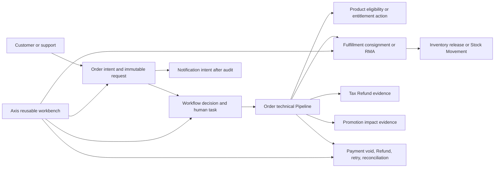

# Order cancellation, Return, and Refund contract

This guide explains the Nodics post-order lifecycle from first principles. It is the canonical module contract for developers, operators, and backend-driven Axis surfaces.

## Terms

- A **cancellation** stops an order quantity before Fulfillment ships it. Payment may void an authorization or refund captured money; Inventory releases only the selected reservation or allocation quantity.
- A **Return** is permission to send a delivered quantity back. The Order request is not the parcel, receipt, inspection, or stock movement. Fulfillment owns those facts through an RMA (return merchandise authorization).
- A **Refund** is a governed business decision to return money. A Refund may follow a Return, or may be approved without physical stock for a missing item, goodwill, or price correction.
- A **void** reverses money that was authorized but not captured. A **refund** reverses a captured or settled Payment transaction.
- A **disposition** says what happens to received goods: inspect, restock as sellable, quarantine, repair, scrap, or return to vendor. Inventory owns every stock effect.
- A **reconciliation-required** state means an owner call may have had an ambiguous result. Operators inspect durable evidence and retry only through the owning service.

## Ownership

Order owns the business request, selected Order Entry quantities, immutable submitted version, high-level state, and append-only Order history. Workflow owns long-running evaluation, human tasks, approvals, escalation, and sequencing. Payment owns provider transactions, original method/provider routing, retry, and settlement reconciliation. Fulfillment owns consignments, RMA, pickup, receipt, inspection, and return shipment evidence. Inventory owns reservation release and returned-stock movement. Product supplies returnability policy; Tax and Promotion remain the authorities for their original evidence and future policy extensions. Axis presents these contracts and never coordinates cross-owner mutations.

## Exact quantities and money

All quantities and money enter as validated decimal strings such as `"1"`, `"1.250"`, or `"12.50"`. JavaScript numbers are forbidden for commercial evidence. Unit codes remain Units-owned. Payment calculation uses deterministic integer arithmetic and configured `HALF_EVEN` rounding. Partial quantities are first-class: cancelling or returning `"1"` from an Order Entry quantity of `"3"` leaves `"2"` active.

## Cancellation journey

1. Customer or support submits selected entries, quantities, optional serials, and a configured reason through a secured intent route.
2. Order reloads the Order and entries. It never trusts a client-supplied historical snapshot.
3. `orderCancellationEligibilityPipeline` asks Inventory, Fulfillment, Payment, and Product for normalized evidence. It creates a plan and has no side effects.
4. `orderCancellationCalculationPipeline` binds original price, Tax, Promotion, delivery, and Payment allocation evidence. Payment calculates exact proportional allocations.
5. Workflow routes automatic or human approval. Human approval uses an access principal and configured maker-checker separation.
6. `orderCancellationExecutionPipeline` delegates Fulfillment cancellation, Inventory release, and Payment void/refund in that order, checkpointing each owner result.
7. Order projects cumulative cancelled quantities and `PARTIALLY_CANCELLED` or `CANCELLED` only after owner steps succeed.

Retries reuse the request code, submitted version, owner allocation identity, original Payment transaction, and provider idempotency key. An ambiguous result becomes `RECONCILIATION_REQUIRED`; Order never guesses or directly repairs an owner record.

## Return and RMA journey

1. Customer or support submits a Return request for a delivered quantity.
2. `returnRequestValidationPipeline` combines Fulfillment delivered/already-returned quantity with Product return-allowed and return-window policy.
3. `returnAuthorizationPipeline` prepares automatic or human authorization. `orderReturnRequestFlow` binds the decision to the submitted request version.
4. Human authorization may approve and reject exact portions of each requested item. Order writes all item decisions and the parent decision atomically; approved plus rejected must equal the immutable requested quantity. Automatic approval cannot silently partially reject an item.
5. After authorization, Workflow creates one idempotent Fulfillment RMA for each item with a positive approved quantity. Fully rejected items create no RMA. This preserves exact item-level identity and lets later partial receipt remain owner-controlled.
6. Fulfillment records pickup or drop-off and normalized tracking evidence.
7. `returnReceiptDispositionPipeline` records exact received quantity, condition, and disposition. It prepares a safe Inventory intent and calls `DefaultReturnDispositionMovementService`.
8. Inventory applies an idempotent Stock Movement for restock, repair, or scrap. Fulfillment closes with only normalized movement evidence.

Warehouse users operate through three separately permissioned Fulfillment endpoints: receive, inspect, and disposition. Fulfillment verifies the Return's enterprise and optional site against the authenticated employee before creating an internal delegated call. Disposition executes the replaceable Fulfillment pipeline and calls Inventory for any physical stock outcome; neither Axis nor the warehouse API writes Stock records directly.

Return status and Refund status stay separate. Warranty, replacement, and exchange execution are deferred, but `requestedOutcome`, reason, item identity, authorization, receipt, and disposition evidence remain available so those outcomes can be introduced without migrating historical requests.

## Refund journey

1. A Refund request selects Order Entry quantities and a configured reason. Physical stock evidence is required only when policy says the Refund follows a Return.
2. `refundCalculationPipeline` adapts immutable selections to Payment-owned exact calculation. The result preserves original Payment allocation, transaction, provider, method, currency, Tax evidence, Promotion evidence, and shipping-policy flags.
   Tax calculates exact proportional Refund tax from original quote-line, jurisdiction, inclusion mode, tax total, and selected quantity. Promotion calculates exact proportional original-discount impact and owns any future qualification-clawback policy. Order coordinates these calls but contains neither Tax nor Promotion rules.
   Fulfillment applies shipping Refund policy to immutable delivery-charge evidence. The default is `NONE`; projects may layer `PROPORTIONAL`, `FULL`, or bounded `FIXED` behavior. A non-zero result must identify a separate original Payment allocation and prove the charge is not already included. Payment then adds it to that original rail, preventing omission, rerouting, or double-refund.
3. `refundApprovalPreparationPipeline` evaluates configured amount threshold, requester type, and normalized risk evidence. Raw fraud-provider payloads are forbidden.
   Layered rules may match enterprise, channel, country, payment method, Return reason, product type, customer segment, risk band, and exact amount. Risk evidence is limited to a human-review flag, band/score, bounded signal codes, assessment code, and provider code. Suspicious evidence can force manual review or a configured rejection; it never carries raw payloads, secrets, fingerprints, or IP addresses.
4. `orderRefundRequestFlow` creates the authorized human task when required. The requester cannot approve the same governed request when maker-checker is enabled.
5. `refundExecutionPipeline` passes only approved allocations to `DefaultPaymentRefundExecutionService`.
6. Payment accepts captured or settled originals only, enforces the original provider/method/currency, checks cumulative reversal does not exceed the original amount, and creates one idempotent provider transaction per allocation.
7. Provider failure or ambiguity becomes `RECONCILIATION_REQUIRED`. Finance retries or reconciles through Payment-owned operations; it never edits Order facts.

Alternate refund destinations are not a framework default. Payment exposes them only as a governed append-only adjustment. The default configuration permits bounded destination types such as wallet, store credit, account credit, or offline handling, and requires the original transaction, exception-policy code, reason, approval evidence, customer-communication evidence, and idempotency. Projects may narrow these types or replace their Payment-owned adapters. The exception must never overload the original-rail path or store destination account credentials.

Finance corrections never rewrite customer or Order facts. A separately permissioned Payment operation creates an append-only `ADJUSTMENT` transaction with exact money, reason, approval evidence, original Refund identity, and stable idempotency. Exception closure creates a separate `RECONCILE` transaction linked to the failed Refund and optional adjustment. The Refund requester cannot approve their own manual adjustment, and all source transactions must match enterprise, Order, Refund, and currency scope.

## Security and privacy

Customer routes require access tokens and reload the Order to enforce `order.customerCode`. Support routes use separate permissions and enforce enterprise plus assigned site/channel scopes when present. Workflow and owner mutation calls require service identity. Generated lifecycle CRUD and hard delete remain disabled. Submitted versions are immutable; stale carriers fail closed.

Business records, history, events, logs, and Axis must not contain card numbers, PAN, CVV, credentials, raw gateway or carrier payloads, labels, warehouse paths, or unnecessary PII. Normalized event contracts contain stable codes, state, correlation identity, and safe timestamps only.

## Events and notifications

Order publishes business lifecycle events only after append-only Order history exists. Events contain bounded whitelisted correlation references for Workflow, Return, Payment transaction, provider reference, movement, consignment, and shipment identities. They never traverse arbitrary owner evidence.

Configured event types include a template code and audience roles as a Notification intent. Order does not choose email, SMS, push, locale rendering, recipient address, retry, or delivery provider; event consumers remain the delivery authority. Fulfillment separately publishes normalized Return receipt/inspection/disposition transitions, and Payment publishes Refund execution/retry/reconciliation/adjustment transitions after durable owner evidence.

Support may record an approve/reject recommendation without becoming the Workflow approver. The recommendation is append-only audit evidence bound to the current request version. Support may also request a customer message using an allowlisted template and bounded primitive variables; Order writes audit first and publishes a Notification intent, but never accepts recipient addresses or delivers the message itself.

## Status and operations

Customer and support status APIs return an Order-owned projection with requested, approved, and rejected quantities per entry. Pending states include a configuration-derived expected-action duration and timestamp; these are service expectations, not promises from Payment, Fulfillment, Inventory, or a provider.

Authorized operations users can query bounded, enterprise-scoped lifecycle workload, reason, SLA, and reconciliation diagnostics. A disabled-by-default CronJob seed can run the same read-only scan. Findings identify the owning recovery path; they never guess provider outcomes or mutate adjacent-owner records. Finance retry and reconciliation remain Payment-owned, separately permissioned, idempotent operations, and request bodies cannot override the authenticated tenant or principal.

## Axis operations

Order publishes backend-driven workspaces for Cancellations, Returns, Refund requests, item evidence, and audit. Workflow provides human approval tasks. Payment publishes the finance Refund and reconciliation queue. Fulfillment publishes the warehouse Returns queue. Inventory publishes Stock Movement and reconciliation evidence. Axis uses its shared grid, query, pagination, sorting, detail, relationship, action, info, and documentation renderers; there are no page-specific CRUD clones.

## Configuration and replacement

Projects layer reason codes, windows, evidence limits, automatic approval thresholds, maker-checker rules, pipeline names, Workflow definitions, provider adapters, and Axis metadata. Replace an individual service or pipeline node through Nodics module hierarchy. Do not fork framework modules, copy Payment provider logic into Order, copy stock logic into Fulfillment, or create another lifecycle authority module.

## Business-user guide

Each user sees only the backend-published workspace and actions allowed by their permissions and scope.

| User | Normal journey | Must not do |
| --- | --- | --- |
| Customer | Open an owned Order, select eligible quantities, submit a configured reason and bounded evidence, then follow the status timeline. | Approve the same request, select another customer's Order, or call owner mutation routes. |
| Support | Search within assigned enterprise/site/channel, inspect linked Order and safe owner history, create on behalf of the matching customer, recommend a decision, and send an allowlisted message intent. | Become the Workflow approver merely by recommending, expose raw provider evidence, or refund directly. |
| Approver | Open the Workflow task, inspect immutable request version, calculation, policy route, and normalized risk evidence, then approve, reject, request information, or escalate. | Approve a stale version or their own request when maker-checker is enabled. |
| Finance | Review Payment-owned Refund transactions, retry a recoverable failure, reconcile provider evidence, or record an approved append-only adjustment/exception closure. | Rewrite Order/customer facts or reroute an ordinary Refund away from its original rail. |
| Warehouse | Receive exact quantity, inspect condition, choose a configured disposition, and review the resulting Inventory evidence. | Write Stock directly or attach raw carrier/warehouse internals. |

`MISSING` is an explicit no-stock warehouse outcome. `RETURN_TO_VENDOR` creates an idempotent Inventory-owned movement into a distinct returned-to-vendor condition. Replacement execution remains deferred; operators preserve the requested outcome and disposition evidence.

## Administrator guide

Administrators layer configuration in a project module; they do not edit framework services. At minimum review:

- `order.orderLifecycle.reasonCodes` for cancellation, Return, and Refund reasons;
- cancellation and Return eligibility windows and Product policy fields;
- Refund approval rules, exact thresholds, risk routes, and maker-checker settings;
- evidence bounds, expected-action/SLA durations, and notification template mappings;
- Fulfillment receipt/disposition policy and Inventory movement mapping;
- Payment original-rail providers, recovery limits, and alternate-destination exception policy;
- route permissions and tenant/enterprise/site/channel role assignments;
- backend navigation metadata and documentation anchors consumed by Axis.

Reason and disposition codes are business contracts. Remove a code only after confirming no active request or historical projection depends on it. Monetary thresholds are decimal strings, never JavaScript numbers. Automatic approval should remain disabled until project-specific policy, risk evidence, and test coverage are present.

## Developer extension recipes

The following examples show the placement and contract shape. Exact project module names are illustrative.

### Override a Return window

Layer Product configuration or replace the Product return-evidence provider. Return `{ returnAllowed, returnWindowDays, policyCode }` for each Order Entry. Do not calculate Product returnability inside Order.

### Override a Refund threshold or approver route

Layer `order.orderLifecycle.refundApproval.approvalRules` with exact amount strings and bounded match fields. For a custom department or enterprise route, replace an approval-preparation Pipeline node or Workflow definition; preserve immutable request/version evidence and maker-checker checks.

### Add a Payment provider adapter

Register the adapter in Payment and return only normalized status, stable provider reference, and safe timestamp. Preserve the original transaction/provider/method/currency checks and Payment idempotency. Never return or persist a raw gateway response.

### Add a Return disposition

Add the code to Fulfillment policy. If stock changes, map it to a supported Inventory Stock Movement type and condition, then extend `DefaultReturnDispositionMovementService` through module replacement. A no-stock outcome must be explicit and tested; Fulfillment must not change a Stock Balance itself.

### Add a Notification

Map a lifecycle event to an allowlisted template and audiences. Publish a Notification intent after durable audit evidence. Notification owns recipient resolution, locale rendering, delivery provider, retry, and delivery result.

## Worked examples

### Full cancellation before capture

An Order has two open Entries and an authorized card transaction. The request selects every remaining quantity. Eligibility confirms releasable Inventory and cancellable Fulfillment allocations. Execution cancels Fulfillment, releases Inventory, voids the exact original authorization, marks every Entry `CANCELLED`, and projects the Order `CANCELLED`.

### Full cancellation after capture

The same selection has a captured transaction. Payment receives the approved allocation with the original transaction/provider/method/currency and creates an idempotent Refund instead of a void. The Order becomes `CANCELLED` only after owner evidence succeeds.

### Partial and non-serialized cancellation

Entry quantity is `3`; the request selects `1`. Inventory releases exactly `1` across its selected assignments, Payment calculates the corresponding exact allocation, the Entry keeps `2` active, and Order projects `PARTIALLY_CANCELLED` without rewriting original checkout evidence.

### Serialized cancellation

The item selection carries the chosen serial identities. Inventory rejects shipped or non-releasable serials, releases only eligible serial assignments, and returns normalized checkpoints. The immutable request, execution history, and status projection retain those identities.

### Digital entitlement cancellation and Refund

A delivered license has Product action `REVOKE_LICENSE`. The execution Pipeline completes Product-owned revocation evidence before Payment reversal and skips physical Fulfillment/Inventory mutation. Payment still refunds the captured original rail; unknown Product lifecycle types fail closed.

### Full and partial Return

Workflow may approve all items or atomically approve/reject exact portions. Fulfillment creates RMA evidence only for positive approved quantities. Receipt may be partial; its quantity and disposition remain Fulfillment facts and any stock result remains Inventory evidence.

### Refund without Return

Goodwill, missing-item, damaged-in-transit, service-credit, or correction reasons may follow configured approval without physical receipt. The request records why no stock is expected. Payment execution remains original-rail by default.

### Return without Refund

Warranty, exchange-only, unpaid COD, already-refunded, or policy-excluded cases may close their RMA without Payment execution. Return and Refund states remain independent and linked by stable references when both exist.

### Multi-payment Refund

An exact amount is distributed across original card and wallet allocations using deterministic proportional rounding. Each result keeps its original transaction/provider/method/currency. Shipping Refund evidence identifies one separate original allocation and proves it was not already included.

### Tax, discount, and shipping

Tax calculates from immutable quote-line and jurisdiction evidence. Promotion calculates original discount impact. Fulfillment chooses `NONE`, `PROPORTIONAL`, `FULL`, or bounded `FIXED` shipping policy. Order coordinates and Payment allocates; none of these rules are copied into Order.

### COD alternate destination

Because COD may have no provider Refund rail, Finance uses the separately permissioned Payment adjustment operation. A wallet/store-credit/account-credit/offline destination requires the original transaction, exception policy, reason, independent approval, customer communication evidence, and idempotency. The record is an append-only exception, not a rewritten original transaction.

### Provider failure and retry

Payment stores `FAILED` with a bounded failure code/message and returns a stable sanitized error. Finance retries through Payment. A successful retry updates recovery evidence and reconciliation reads the durable normalized transaction; no raw provider exception reaches Order or Axis.

## Ownership flow

The arrows are API/service delegation and normalized evidence, not shared database writes. Axis calls one backend-owned operation at a time and never orchestrates this graph itself.

## Business management and policy

BackOffice metadata exposes task-focused cancellation, Return/Refund, support,
approval, exception, policy, and reason workspaces. Axis uses its reusable
Workbench renderer and backend-declared action inputs; it does not own reason
lists, rule matrices, permissions, state visibility, or API routing. Support
starts one Order intent from a scoped Order and can inspect related Order,
Payment, shipment, Return/Refund, and audit evidence. Approvers submit one
Workflow-owned decision with bounded evidence.

`orderLifecyclePolicyRule` and `orderLifecycleReason` are private persisted
configuration evidence. Only `DefaultOrderLifecyclePolicyManagementService`
may update them. Updates use optimistic versions, return to `DRAFT`, and a
different employee activates the revision. Seeded defaults cover cancellation
and Return windows, Refund approval, evidence, and standard reasons; projects
layer further policy records instead of adding client rules. Hard delete and
direct generated mutation are prohibited.

Operations diagnostics compose bounded contributions from Order, Payment, and
Inventory. Payment uses Units exact arithmetic for Refund totals and reports
safe provider latency/failure/retry and over-Refund/orphan findings. Inventory
reports Return dispositions and correlation gaps. Notification posts a
service-authenticated normalized delivery result back to Order audit using a
stable delivery code; recipient data and provider payloads are rejected.

## Security-governance checklist

Before enabling a project route, verify:

1. tenant and enterprise are taken from trusted request/auth context and cannot be overridden by a body envelope;
2. customer ownership or employee site/channel scope is rechecked against the loaded Order;
3. customer, support, approver, finance, warehouse, and administrator permissions are distinct;
4. human approval binds to the submitted version and enforces maker-checker separation;
5. every owner mutation uses a stable idempotency identity and rejects conflicting replay;
6. the original Payment provider/method/currency and cumulative refundable bound are enforced;
7. audit evidence precedes outward events/messages, and retry/reconciliation remain append-only;
8. raw provider/carrier payloads, credentials, PAN/CVV, fingerprints, IP addresses, warehouse paths, and unnecessary PII are rejected;
9. client errors are stable and sanitized while permissioned diagnostics retain safe recovery codes;
10. customer self-service rate limits use shared Order persistence, principal+Order windows, and idempotent-replay detection; support remains separately permissioned.

## Architecture-compliance rules

- Put request schemas, intent APIs, projections, and business history in Order.
- Put Refund transactions, provider adapters, retry, reconciliation, and manual finance adjustments in Payment.
- Put RMA, pickup, shipment, receipt, inspection, and disposition orchestration in Fulfillment.
- Put reservation release, Stock Balance mutation, and Stock Movement evidence in Inventory.
- Put returnability/entitlement policy in Product, tax evidence in Tax, discount impact in Promotion, human tasks in Workflow, and delivery in Notification.
- Keep `gComm` group modules composition-only. Put business logic in the leaf owner module.
- Put technical sequencing in replaceable Pipeline nodes and long-running/human sequencing in Workflow.
- Keep property files declarative. Do not place executable business logic in configuration.
- Extend through layered configuration, service replacement, Pipeline nodes, Workflow definitions, and provider adapters.
- Use Axis reusable workbench renderers and backend metadata. Never add page-specific duplicate grids, details, query builders, or a client-side multi-owner transaction coordinator.

Prohibited shortcuts include public generated CRUD for lifecycle aggregates, direct Stock writes from Fulfillment, direct provider Refunds from Order/Axis, copied Tax/Promotion calculations, raw provider evidence in records/events, mutable historical allocation rewrites, JavaScript floating-point money, and a second cancellation/Return/Refund authority module.

## Quote, risk, and exchange decisions

Quote is deferred to the B2B/assisted-sales workstream and is not a prerequisite. Lifecycle requests bind to immutable Order evidence and do not assume storefront Cart origin; future quote, assisted-sales, subscription, import, marketplace, support-adjustment, or external-capture origins can preserve their source references and original commercial allocations. Quote-specific windows, thresholds, and sales-representative notification belong to layered Product/Order policy when that workstream arrives.

Fraud/risk remains normalized external-owner evidence rather than a new Commerce authority. Refund policy may match bounded signals such as amount, repeated Return band, unusual payment-method code, delivery-address mismatch signal, chargeback-history band, suspicious-account signal, or provider risk response. Raw provider payload, device fingerprint, and IP address remain prohibited.

Exchange/replacement execution is explicitly deferred. Current models preserve requested outcome, Return reason, item/serial identity, condition, authorization, RMA, receipt, disposition, original Order, and commercial evidence. That representation supports future return-without-refund, refund-without-return, replacement-without-refund, and replacement-with-price-difference flows without migrating historical requests.

## Verification map

- Foundation and private persistence: `orderLifecycleRequestFoundationContract.test.js`, `orderLifecycleOrchestrationContract.test.js`.
- Cancellation: eligibility, calculation, Workflow, owner evidence, execution, and intent contract tests under `gComm/checkout/order/test` plus owner-module cancellation tests.
- Return: `orderReturnValidationContract.test.js`, `orderReturnWorkflowContract.test.js`, `fulfillmentReturnRequestContract.test.js`, `returnReceiptDispositionPipelineContract.test.js`, and `returnDispositionMovementContract.test.js`.
- Refund: `orderRefundPipelineContract.test.js`, `orderRefundWorkflowContract.test.js`, `paymentRefundCalculationContract.test.js`, and `paymentRefundExecutionContract.test.js`.
- Commercial Refund evidence: `taxRefundEvidenceContract.test.js`, `promotionRefundImpactContract.test.js`, and `orderCancellationCalculationContract.test.js`.
- Shipping Refund policy: `shippingRefundPolicyContract.test.js`.
- Security and events: lifecycle intent, route authorization, original-rail execution, audit, and lifecycle event contract tests.
- Owner events: `fulfillmentReturnEventContract.test.js` and `paymentRefundEventContract.test.js`.
- Support operations: `orderLifecycleSupportContract.test.js`.
- Status and operations: `orderLifecycleStatusProjectionContract.test.js`, `orderLifecycleDiagnosticsContract.test.js`, `paymentRefundOperationsSecurityContract.test.js`, and `paymentRefundAdjustmentContract.test.js`.
- Policy, Workflow assignment, and Axis contracts: `orderLifecyclePolicyContract.test.js`, `orderLifecyclePolicyManagementContract.test.js`, `workflowAssignmentContract.test.js`, `orderLifecycleBackofficeContract.test.js`, and the Axis bootstrap/workbench lifecycle-action tests.
- Delivery and owner diagnostics: `orderLifecycleNotificationResultContract.test.js`, `paymentRefundDiagnosticsContract.test.js`, and `returnStockDiagnosticsContract.test.js`.
