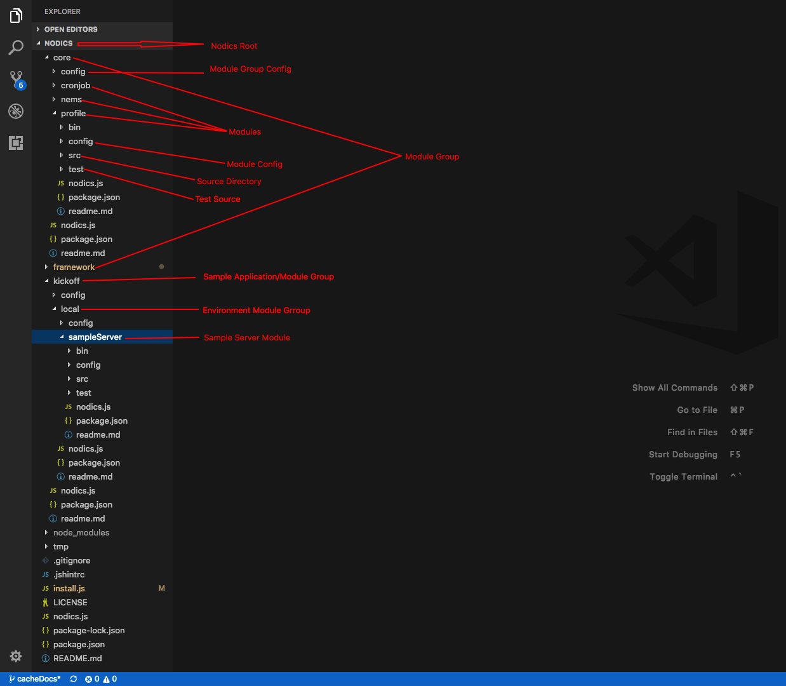
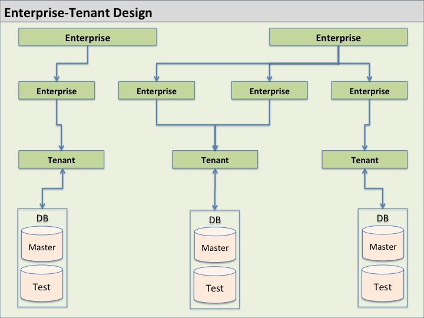

# How Nodics Is Organized

Nodics is organized around capabilities.

A capability is something the application can do, such as manage users, expose APIs, connect to a database, run scheduled jobs, process imports, publish events, or apply runtime configuration.

Each capability has a clear owner.

## The Big Picture

A Nodics application usually contains:

- Framework capabilities supplied by Nodics.
- Core business capabilities supplied by Nodics or a project.
- Customer project capabilities.
- Environment definitions.
- Server definitions.
- Node definitions.
- Runtime and tenant configuration.

This structure lets a project customize behavior without modifying framework files.



## Framework Walkthrough

Read Nodics from the outside in:

1. The project defines the application boundary.
2. Environments define deployment contexts such as local, development, QA, pre-production, and production.
3. Servers define runnable process compositions and active modules.
4. Nodes define instance-level responsibilities below a server.
5. Module groups organize related modules.
6. Capability modules own configuration, schemas, routes, controllers, facades, services, pipelines, interceptors, events, search indexes, data, tests, and documentation.
7. Generated artifacts are produced from source definitions.
8. Runtime governance can preview, approve, activate, audit, and roll back selected mutable behavior.

This walkthrough matters because a Nodics change is usually not made in one global application folder. It belongs to the layer and module that owns the capability.

## The Ownership Rule

Before adding code, configuration, data, or tests, ask:

```text
Who owns this capability?
```

The owner is the smallest boundary that can explain, configure, test, document, and override the behavior safely.

Use this order when deciding ownership:

1. Customer or project module for customer-specific behavior.
2. Environment, server, or node module for deployment or runtime topology behavior.
3. Tenant or runtime configuration for governed runtime differences.
4. Domain or core capability module for reusable business behavior.
5. Framework module only when the framework capability itself must change.

This rule helps both human developers and AI tools avoid the most common mistake: putting new behavior in the first file that looks convenient instead of the module that owns the capability.

## Application Project

An application project represents the product or customer application built on top of Nodics.

It usually contains:

- Project metadata.
- Project modules.
- Environment definitions.
- Server definitions.
- Node definitions.
- Project documentation.

Use the project area for customer-specific behavior, application-specific modules, and environment setup.

## Module Groups

A module group is a folder that groups related modules.

For example, one group may contain content modules, another may contain commerce modules, and another may contain data-processing modules.

Use a group when capabilities belong together but still need separate ownership.

A group may own shared documentation, shared defaults, and child module ordering. A pure group does not own concrete business behavior unless it intentionally has source, tests, and documentation for that behavior.

## Capability Modules

A capability module owns one feature area.

A module can include:

- Configuration.
- Schemas.
- Routes.
- Services.
- Controllers.
- Facades.
- Pipelines.
- Interceptors.
- Events.
- Utility definitions.
- Initial data.
- Sample data.
- Tests.
- Documentation.

When adding behavior, first ask:

```text
Which capability owns this?
```

If the answer is unclear, do not create a random folder. Decide the owner first.

## Standard Module Layers

Many capability modules use the same layered shape:

- `config/` for configurable values and startup hooks.
- `src/schemas/` for data and generation definitions.
- `src/router/` for API route definitions.
- `src/controller/` for request-level behavior.
- `src/facade/` for orchestration across services or module boundaries.
- `src/service/` for business behavior and replaceable service logic.
- `src/pipelines/` for process pipelines.
- `src/interceptors/` for lifecycle and validation hooks.
- `src/event/` for event listeners.
- `src/search/` for index definitions.
- `src/utils/` for utilities, enums, and status definitions.
- `data/` for module-owned init, core, or sample records.
- `test/` for default behavior and override behavior.

Nodics modules use Router, Controller, Facade, Service, DAO, and Schema layers. Current Nodics also makes configuration, search, pipelines, interceptors, generated artifacts, LLM context, and runtime governance part of the module contract.

## Environments

An environment represents where the application runs, such as local, development, UAT, pre-production, or production.

Environment configuration describes environment-level behavior. It does not become a place for unrelated business logic.

An environment is treated as a group module because it contains server modules. It may own deployment-wide defaults, environment-owned data, documentation, and the server catalog for that environment.

## Servers

A server defines a runnable application process or group of active modules.

For example, one server may run all capabilities together for local development. Another setup may split profile, workflow, events, and scheduled jobs into separate servers.

Use servers to define runtime boundaries.

A server owns process-level active module selection, ports, runtime configuration, server-specific data, server tests, and generated runtime reports. Server configuration decides which modules run in that process.

## Nodes

A node is a more specific runtime unit below a server.

Node configuration is useful when multiple processes of the same server type need different responsibilities, ports, ownership rules, or scheduled-job behavior.

A node owns instance-specific overrides below a selected server. It does not replace server-wide process composition or environment-wide configuration.

## Enterprise And Tenant Structure

Nodics can model more than one business inside the same platform. An enterprise can represent a company, group, or business owner. Sub-enterprises can represent business units, brands, regions, or operating divisions. Tenants isolate users, data, configuration, permissions, imports, jobs, runtime behavior, and integration contracts for a selected business context.



Use tenant structure when one platform must support multiple customers, companies, brands, catalogs, business units, or deployment contexts without mixing their data or permissions. Keep tenant behavior explicit in schemas, services, routes, imports, events, jobs, cache keys, and tests.

## Layered Customization

Nodics loads behavior in a defined order. Later layers can override earlier behavior when the contract allows it.

This is the most important customization rule:

```text
Do not change framework code for a customer-specific need when a later project layer can provide the behavior.
```

Examples:

- Add a project service with the same service function to override behavior.
- Add project configuration to override default configuration.
- Add project schemas or route configuration through the supported hierarchy.
- Add project data rather than changing framework seed data.
- Add provider modules for new adapters such as a database, cache engine, or search engine.

Keep local activation and remote communication separate. `activeModules` decides what runs inside the current process. Server endpoint coordinates describe how one process talks to another. Tenant or customer context may refine behavior after startup, but it must not secretly activate modules.

## Generated Artifacts

Many Nodics artifacts are generated from source definitions. Generated output can include models, services, facades, controllers, routers, OpenAPI contracts, generated tests, governance reports, and generated LLM context.

The rule is simple:

```text
Change the source definition, then regenerate.
```

Do not hand-edit generated output as the long-term fix. If generated behavior is wrong, fix the schema, route, configuration, generator, or source contract that owns it.

## How AI Tools Should Use This Structure

AI tools do not invent a new folder, export style, configuration file, or runtime path.

When an AI tool helps implement a feature, it names:

- the owning capability;
- the project, environment, server, node, tenant, or framework layer that should own the change;
- the source definition or loader-visible file to modify;
- the configuration keys involved;
- the generated artifacts affected;
- the tests that prove default and override behavior;
- the documentation that must be updated.

## Where Documentation Belongs

Use this public documentation for user guides and task-based explanations.

Use module README files for module-specific behavior.

Use AI/developer contracts only for implementation rules. Do not make public users read AI governance material just to understand how to build a feature.
