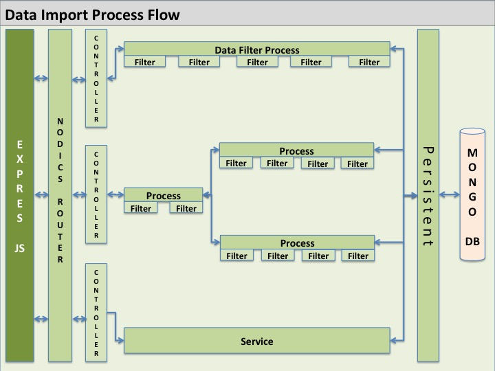
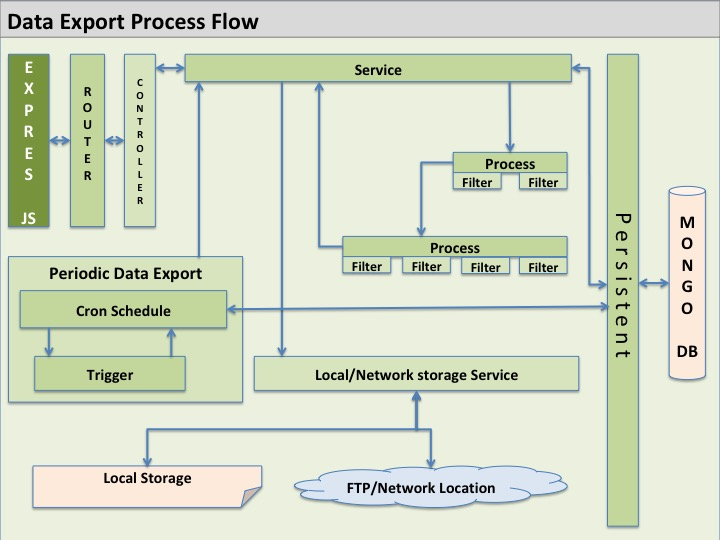

# How To Work With Data

Nodics data behavior is built around schemas, data access services, import/export, tenant context, and provider modules.

Data changes must be safe, testable, and reversible where the business process requires it.

## Beginner Summary

In Nodics, data work usually starts from a schema.

A schema says what a record looks like. From that source definition, Nodics can
generate or coordinate models, CRUD APIs, services, search indexes, imports,
exports, OpenAPI output, and tests. This is why generated files should not be
edited by hand. If the data shape is wrong, fix the schema or the later schema
override and regenerate.

Use this simple map:

| Need | Start here |
| --- | --- |
| Add a new data type | Owning module `src/schemas/schemas.js` |
| Add a field or remove a field for a project | Later project module schema contribution |
| Add searchable fields | `src/search/indexes.js` and search module docs |
| Add validation before save/update/remove | `src/interceptors/interceptors.js`, validators, or model pipelines |
| Change database behavior | Database provider module or project provider module |
| Import records from files | Import configuration, data files, and import pipeline |
| Export records to a target format | Export module/service/pipeline once the export requirement is defined |
| Add startup records | Module `data/initial` or owned initializer data |
| Add demo/local records | Module `data/sample` |

The safest rule is:

```text
Schema defines data. Services use data. Providers store data.
```

## Schemas

A schema defines the shape of stored data.

When creating or changing a schema, document:

- Purpose of the data.
- Required fields.
- Optional fields.
- Relationships to other schemas.
- Tenant behavior.
- Index requirements.
- Access policy.
- Import/export behavior.
- Generated API impact.

After changing schemas, rebuild and run generated tests.

## Schema Definitions

Schemas are the starting point for models, DAO behavior, services, facades, controllers, routers, and generated APIs.

Treat schema definitions as source definitions. They affect:

- persistence models;
- generated CRUD behavior;
- services and facades;
- route/API contracts;
- search indexes;
- validators and interceptors;
- import/export behavior;
- OpenAPI output;
- generated schema, CRUD, API, and scenario tests;
- runtime governance and access policies.

Do not edit generated model or API output to change schema behavior. Change the schema definition, regenerate, and validate.

## Schema Extension

Nodics supports layered schema contribution and override behavior. A later project module may extend, replace, or refine schema definitions when the capability contract allows it.

When changing a schema through a later module, document:

- the original owning module;
- the later module that contributes the change;
- the fields added, removed, or changed;
- generated artifacts affected;
- migration or data compatibility impact;
- tenant and access-policy impact;
- tests proving the default schema and override schema behavior.

### Generalizing Definitions

Generalizing a schema definition means a later module changes the effective schema contract through the supported module hierarchy.

Use schema generalization when a project needs to:

- add a field;
- remove a default field from the effective project schema;
- change validation rules;
- refine access policy;
- add lifecycle state;
- add import/export behavior;
- add search index behavior;
- specialize a nested or referenced data shape.

Do not edit generated models to generalize a schema. Change the owning schema definition or later project schema contribution, regenerate, and run generated tests against the effective schema.

### Schema Enumeration Type

Use schema enum values when a property accepts only a controlled list of values.

Document the business meaning of each value, the default value, whether projects can add values, and what generated API/import/export behavior depends on the enum. If a project removes or changes an enum value, project tests must prove that generated CRUD, imports, search indexing, and business services no longer depend on the removed value.

## Nested And Referenced Data

Data may be embedded, nested, or referenced depending on the business model.

Use embedded or nested data when the child data belongs fully to the parent lifecycle. Use references when records have their own lifecycle, permissions, ownership, or reuse.

For referenced data, document:

- referenced schema;
- relationship cardinality;
- lookup behavior;
- delete/update impact;
- tenant boundary;
- import/export representation.

### Inline Schema

Use inline schema definitions for small child structures that have no independent lifecycle. For example, a simple address fragment, display option, audit snapshot, or embedded metadata block may belong inside its parent model.

Inline data should not be used when the child record needs its own permissions, imports, search index, events, workflow, versioning, or independent update lifecycle. In those cases, use a separate schema and a reference.

### Referencing Schema

Use referenced schemas when records have separate ownership or lifecycle.

Reference data when:

- the child record is reused by multiple parents;
- access policy differs between parent and child;
- the child has its own CRUD API;
- the child needs import/export independently;
- the child is searchable on its own;
- deleting or updating the child must be governed separately.

For every reference, document cardinality, lookup behavior, tenant boundary, delete/update rules, import/export representation, and generated API impact.

## Database Providers

Nodics supports database behavior through provider modules.

For example, MongoDB and Cassandra support live under their own provider areas. If a project needs another database such as Oracle, add it as a provider module with its own connection handling, DAO behavior, configuration, tests, and documentation.

Do not put Oracle-specific behavior into the generic database layer.

## Adding A Provider Such As Oracle

When a customer project needs Oracle, do not add Oracle calls inside business
services or generated controllers. Add a provider implementation behind the
database capability contract.

Beginner implementation path:

1. Read [nDatabase](../../gFramework/nDatabase/README.md) and the current
   provider README files.
2. Create or choose a provider module owned by the project or framework.
3. Put provider configuration defaults in `config/properties.js`.
4. Put connection lifecycle code in provider-owned services.
5. Put provider-specific DAO/query behavior behind the same database contract
   used by business services.
6. Keep credentials, hosts, schemas, pools, and secret paths in configuration or
   secret management.
7. Add deterministic tests without requiring a live Oracle server.
8. Add optional live-provider tests behind a release/integration gate.
9. Document how the project activates the provider for a server, node, or
   tenant.

The business capability should still call Nodics services or DAOs. It should
not need to know whether the final provider is MongoDB, Cassandra, Oracle, or
another database.

## Managing Database

Database behavior is owned by the database capability and provider modules. Application code should call services, facades, generated schema services, or approved DAO contracts instead of directly using provider clients.

When working with database behavior, check:

- which schema owns the data;
- which provider is active for the selected server/tenant;
- which DAO or generated service owns persistence;
- whether the operation runs in the master or test channel;
- whether tenant context is resolved correctly;
- whether access policy and interceptors run before persistence;
- whether generated artifacts are current.

Do not hardcode database names, collection names, credentials, hosts, or provider-specific query behavior in controllers or generic services. Put provider details in provider modules and layered configuration.

## Adding A New Database Provider

A new provider defines:

- Connection configuration.
- Connection lifecycle.
- Model or query abstraction.
- DAO operations.
- Tenant-aware database resolution.
- Error handling.
- Health diagnostics.
- Tests for normal and failure behavior.
- Documentation explaining how projects activate it.

The generic database capability describes the contract. The provider module implements it.

## Related Module Documentation

For exact implementation details, read:

- [nDatabase](../../gFramework/nDatabase/README.md) for database capability ownership and provider contracts.
- [database](../../gFramework/nDatabase/database/README.md) for generated CRUD, schema access policy, model pipelines, and DAO lifecycle behavior.
- [mongodb](../../gFramework/nDatabase/mongodb/README.md) and [cassandradb](../../gFramework/nDatabase/cassandradb/README.md) for current database providers.
- [nData](../../gFramework/nData/README.md), [nImport](../../gFramework/nData/nImport/README.md), and [nExport](../../gFramework/nData/nExport/README.md) for import/export behavior.
- [nSearch](../../gFramework/nSearch/README.md) and [search](../../gFramework/nSearch/search/README.md) for search indexes and searchable data.
- [Module Documentation Index](../reference/module-documentation-index.md) when you need to find another data-related module.

## Data Access Layer

The data access layer owns persistence operations and protects the rest of the application from provider-specific details.

Business behavior calls services or facades. Controllers do not directly query the database. Provider-specific DAO logic lives in the provider module or project module that owns that implementation.

When adding a new DAO function, document:

- target schema;
- input contract;
- output contract;
- tenant behavior;
- error and retry behavior;
- provider-specific assumptions;
- tests for default and failure paths.

## Initial Data

Initial data is loaded during startup when the system needs baseline records.

Use initial data for required records such as core groups, permissions, or mandatory catalog entries.

Initial data is idempotent. Starting the server twice does not create duplicate records.

## Sample Data

Sample data is optional data used for demonstrations, testing, or local development.

Sample data is not required production data.

## Import And Export

Nodics supports import and export flows for structured data.



For a business-oriented data hub pattern, read [How To Use Nodics As Data As A Service](how-to-use-nodics-as-data-as-a-service.md).

For a beginner, import means "bring data into Nodics through a governed process."
Export means "send selected Nodics data out in a governed format and location."
Both should use configuration, pipelines, processors, interceptors, tenant
context, audit/history, and tests instead of one-off scripts.

## Data Feeding Patterns

Nodics supports two main ways to feed data into the platform.

### Push-Based Import

In push-based import, an external system calls Nodics import APIs and sends the data to Nodics.

Use this pattern when the source system controls when data should be delivered.

Examples:

- an ERP system pushes product or inventory updates;
- a partner system pushes customer, order, or catalog records;
- a supplier portal sends product attributes;
- an admin tool uploads an approved import payload;
- a business application pushes data after its own workflow completes.

The flow is:

```text
External system
  -> Nodics import API
  -> import pipeline
  -> filters, validators, processors, interceptors
  -> tenant-aware persistence
  -> errors or success summary
  -> events, search indexing, audit, import history
```

The caller may provide the payload or file reference allowed by the route contract. Nodics still owns validation, tenant resolution, access control, diagnostics, and persistence behavior.

### Scheduled File Import

In scheduled file import, data is placed in a configured location and Nodics picks it up through a scheduled process, usually a CronJob.

Use this pattern when the source system produces files on a schedule or cannot call Nodics APIs directly.

Examples:

- supplier CSV files are placed in an import folder;
- ERP exports Excel files every night;
- product catalog JSON files are placed in a governed server import location;
- business users upload approved files to a governed server location;
- a CronJob checks for pending files every few minutes or hours.

The flow is:

```text
External system
  -> configured file location
  -> Nodics CronJob or scheduled trigger
  -> import service
  -> import pipeline
  -> filters, validators, processors, interceptors
  -> tenant-aware persistence
  -> events, search indexing, audit, import history
```

Scheduled file import can use JSON, JavaScript data definitions, Excel, CSV, or any other supported file processor. The source system or operations process is responsible for placing files in the expected Nodics import location. Nodics is responsible for reading only the configured files, validating them, importing them through the same governed pipeline, and recording diagnostics.

Remote import adapters are a specialized scheduled file import pattern. They are used when Nodics must stage files from SFTP, object storage, partner APIs, HTTPS pulls, enterprise file gateways, or similar external locations before running the import pipeline. This requires a project or provider source to be selected, configured, governed, and tested.

Both patterns must enter the same governed import lifecycle. Do not create a separate persistence path just because the source is API-based, file-based, scheduled, or remote.

## Remote Import Adapter Pattern

Nodics already supports remote import as a governed adapter-staging capability.
This is the enterprise data hub pattern used when source systems produce files
outside the active Nodics server, but the import must still run through Nodics
tenant resolution, trusted headers, processors, interceptors, validators,
diagnostics, target routing, and import history.

Use remote import when:

- a supplier drops CSV or Excel files on SFTP;
- an ERP exports product, inventory, price, or customer data to object storage;
- a partner exposes approved data files through a secured API;
- a business team publishes approved catalog files through an enterprise file gateway;
- a CronJob must periodically bring remote data into Nodics without giving the remote system write access to Nodics APIs.

The remote source provides data files only. Nodics active modules provide the
import headers, processing rules, target schema or index, processors,
interceptors, validators, and access policy. This is the key safety boundary:
external systems may supply data, but they must not supply executable headers,
schema definitions, service names, arbitrary URLs, credentials, processors, or
routing rules at runtime.

The high-level flow is:

```text
CronJob, service, facade, or governed project trigger
  -> DefaultImportService.importRemoteData(request)
  -> remoteDataImportInitializerPipeline
  -> validate active tenant, active modules, source, transport, and adapter
  -> stage files into an isolated server-owned staging folder
  -> enforce policy: timeout, retry, file count, size, extension, symlink, checksum
  -> load trusted import headers from active modules
  -> finalize staged files through the normal data import initializer
  -> process finalized records through processDataImportPipeline
  -> dispatch to schema services or search services
  -> record diagnostics, run history, success, failure, and cleanup
```

Remote import is disabled by default. A project or provider module enables it
through layered `config/properties.js`:

```js
data: {
    remoteImport: {
        enabled: true,
        defaultTransport: 'partnerSftp',
        defaultHeaderDataType: 'core',
        cleanupStaging: true,
        policy: {
            timeoutMs: 30000,
            retries: 1,
            maxFiles: 100,
            maxFileBytes: 10485760,
            maxTotalBytes: 104857600,
            allowedExtensions: ['json', 'csv', 'xlsx'],
            requireChecksums: true
        },
        transports: {
            partnerSftp: {
                enabled: true,
                service: 'DefaultPartnerSftpImportAdapterService'
            }
        },
        sources: {
            supplierCatalog: {
                enabled: true,
                transport: 'partnerSftp',
                tenants: ['default'],
                modules: ['profile', 'catalog'],
                headerDataType: 'core'
            }
        }
    }
}
```

Requests select a configured source name:

```js
SERVICE.DefaultImportService.importRemoteData({
    tenant: 'default',
    modules: ['profile', 'catalog'],
    remoteImport: {
        source: 'supplierCatalog'
    }
});
```

The adapter service must be loader-visible under the project or provider module
and expose `stage(context)`. Nodics passes an assigned `targetPath`, tenant,
module list, source configuration, transport configuration, timeout, abort
signal, and correlation id. The adapter must place files only under the assigned
target path and return a staged-file inventory:

```js
module.exports = {
    stage: function (context) {
        return Promise.resolve({
            rootPath: context.targetPath,
            files: [
                {
                    path: 'products.csv',
                    sha256: '<lowercase sha256 checksum>'
                }
            ]
        });
    }
};
```

Remote import policy protects the platform before any file is finalized:

- the source must be enabled;
- the request tenant must be active and allowed by the source;
- requested modules must be active and allowed by the source;
- the transport adapter service must exist and implement `stage(context)`;
- staged files must remain inside the assigned server-owned folder;
- symbolic links are rejected;
- file count, file size, total size, allowed extensions, timeout, and retries are bounded;
- SHA-256 checksums are required unless the effective policy explicitly disables them;
- diagnostics record source, transport, attempts, file counts, and byte totals without exposing credentials.

Remote import can run in discovery/finalization mode or full import mode. When
`importFinalizeData` is `false`, Nodics stages and finalizes input without
dispatching finalized records to the target services. The normal mode finalizes
and then processes records through `processDataImportPipeline`.

Do not expose a generic public remote-import route for arbitrary callers. A
production route can be added only when the project/provider module owns the
source contract, adapter, route permission, tenant and module allowlists,
credential handling, operational monitoring, and guarded integration or release
tests.

## Import Failure And Batch Behavior

Nodics imports can run in a safe record-by-record mode or in configured batches.
Both modes use the same import pipeline and target services.

Use `data.stopImportOnFailure` to choose the failure mode:

- `false` is the default data-feed behavior. Nodics continues later records or
  batches, records every failure in diagnostics, leaves failed records
  unprocessed for retry, and returns an aggregate import error after the attempt.
- `true` is fail-fast behavior. Nodics stops at the first failed record or batch
  and returns that failure immediately.

Use `data.batchImport` to choose finalized-record dispatch size:

```js
data: {
    batchImport: {
        enabled: true,
        size: 100
    }
}
```

When batching is enabled, Nodics groups unprocessed finalized records by
`size` and sends each group through `processModelImportPipeline`. This reduces
pipeline dispatch overhead for file-based and finalized imports while
preserving validation, relation macros, tenant scope, schema/search target
routing, access policy, interceptors, diagnostics, and import history.

An individual import header can override the global behavior:

```js
options: {
    batchImport: {
        enabled: true,
        size: 50
    },
    stopImportOnFailure: false
}
```

A successful batch marks every record in that batch as processed. A failed
batch records failure details for every record in that batch and leaves those
records unprocessed so they can be retried after the source data or target
configuration is corrected.

Do not create a separate direct database or search writer just to make import
faster. Provider-native bulk insert or bulk indexing must be implemented behind
the same schema service, search service, validation, security, and diagnostics
contracts.

An import process explains:

- Which file formats are supported.
- Which tenant receives the data.
- Which schema is targeted.
- Whether the target is database persistence or search indexing.
- How validation works.
- How duplicate headers are handled.
- What diagnostics are produced.
- Whether import history is recorded.
- Whether rollback or retry behavior exists.
- Whether batch import is enabled and what size is safe for the target service.

## Import Targets

Nodics import can write finalized data to database-backed schemas or to search
indexes.

For database import, the header uses `schemaName`. Nodics sends the finalized
models to the generated schema service, such as `DefaultProductService.saveAll`.
That means import uses the same tenant, service, DAO, schema validation,
interceptor, access-policy, diagnostics, and generated behavior as normal API
writes.

For search import, the header uses `indexName`. Nodics sends the finalized
models to the search service operation, such as a save operation on
`DefaultSearchService` or an index-specific service when one exists. The import
keeps the full model array for bulk indexing and also passes the first model for
single-record service compatibility.

The target route is defined by trusted module-owned headers. Do not let a caller
choose an arbitrary database table, index, service, provider, URL, or operation
from request data. If a project needs a new import target, define the schema,
index, service operation, processor, validator, and permission model in the
owning module layer.

## Export Contracts

Nodics export is the controlled data-egress side of the data platform.



The shared export engine currently fails closed by default. It normalizes export
requests and provides access-policy delegation, but it does not export data
until a framework, provider, or project module supplies a governed export
implementation. This prevents accidental leakage through a generic
`/system/export` route.

A production export must be definition-driven. A caller should select an
approved export definition, not arbitrary schemas, services, filters, URLs,
filesystem paths, credentials, or destination contracts. The export definition
should declare:

- source schema or owning service;
- tenant and catalog scope;
- allowed filters and maximum result size;
- output format;
- formatter options;
- destination alias;
- access group or permission requirement;
- retry, timeout, and diagnostics policy.

Before data leaves Nodics, the exporter must apply schema/property export access
policies. Export filtering must operate on export-safe copies so selected source
models are not mutated in memory. Rendering belongs to format modules such as
JSON, CSV, Excel, JavaScript, or a project-owned format. Delivery belongs to a
provider/project module such as filesystem, SFTP, object storage, API push,
message publication, or an enterprise gateway.

Do not treat the current format modules as complete production writers. They
are extension boundaries until their renderer contracts and release tests are
implemented.

A public production remote-import route stays gated until a project or provider
module owns the adapter, source configuration, tenant/module allowlists,
checksum policy, staging behavior, sanitized diagnostics, and live integration
tests. Do not expose a public remote-import route for a source that has only
deterministic framework tests.

Run data movement tests through:

```bash
npm run test:import
npm run test:export
```

## Access Policy

Data access must respect authentication, authorization, tenant context, schema access policy, and route permissions.

Do not add direct database access that bypasses the owning service or policy layer.

## What To Avoid

Avoid:

- Writing direct database code in controllers.
- Mixing provider-specific logic into generic services.
- Creating duplicate data during repeated startup.
- Editing generated model or API output manually.
- Importing production data into test tenants.
- Storing secrets in source-controlled configuration.

## Continue

- Next: [How To Use Nodics As Data As A Service](how-to-use-nodics-as-data-as-a-service.md)
- Owning modules: [Module Documentation Index](../reference/module-documentation-index.md)
- Documentation home: [Nodics Documentation](../README.md)
