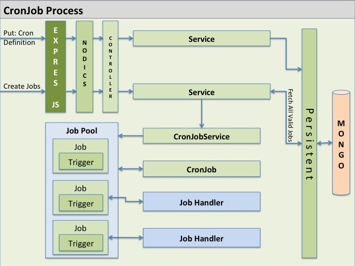
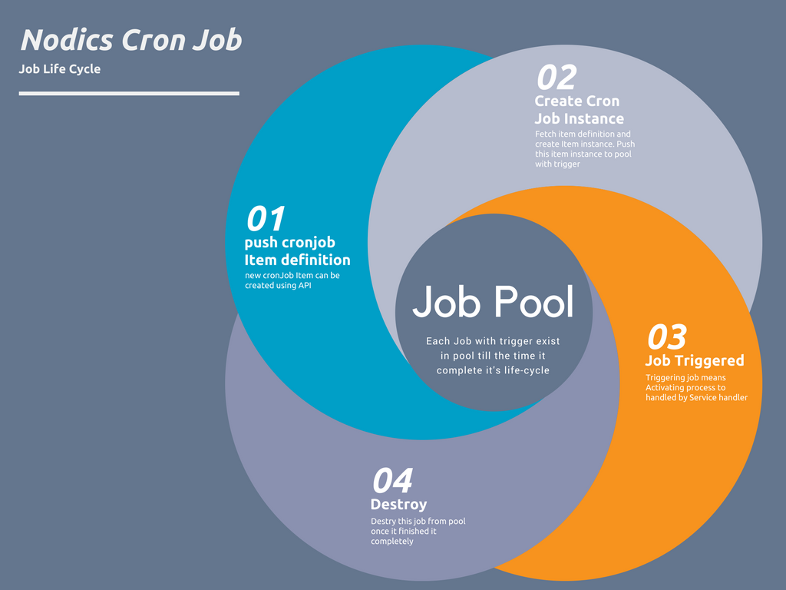

# How To Create Scheduled Jobs

Scheduled jobs are automated tasks that run at configured times.

Examples:

- Clean expired tokens.
- Send queued messages.
- Import files from a trusted location.
- Rebuild indexes.
- Publish pending content.
- Reconcile failed workflow items.

## CronJobs

CronJobs are Nodics scheduled tasks with persisted definitions, lifecycle operations, handlers, logs, route/service ownership, node responsibility, and tests.

A CronJob should not be only a timer in memory. It should have a definition that explains what runs, when it runs, who owns it, how it is started or stopped, how failures are recorded, and which server/node may execute it.

## When To Use A Scheduled Job

Use a scheduled job when work runs automatically without a user request.

Do not use a scheduled job when:

- The work must happen immediately inside an API transaction.
- The work belongs on an event.
- The work belongs to a workflow step.
- The work requires manual approval before every run.

## What A Job Needs

A scheduled job usually needs:

- A name.
- A schedule.
- An owner module.
- A service function to execute.
- Configuration.
- Permission or runtime guard rules when applicable.
- Logs.
- Failure handling.
- Tests.

In Nodics, a scheduled job is a persisted platform capability. The job definition, trigger information, handler/service behavior, logs, and lifecycle state are visible and testable.



## Node Ownership

In a multi-node application, not every node runs every job.

Document:

- Which server or node owns the job.
- Whether failover is allowed.
- Whether only one node can run it at a time.
- What happens if the node stops during execution.

This is important because duplicate scheduled work can create duplicate data, repeated messages, or conflicting updates.

## Job Implementation Pattern

Keep the actual business behavior in a service.

The job triggers the service. The service is testable without waiting for the schedule.

Recommended shape:

1. Job definition identifies when and where the job runs.
2. Job handler receives execution context.
3. Handler calls the owning service.
4. Service validates input and tenant context.
5. Service performs work.
6. Result is logged.
7. Failure is captured with diagnostics.

## Job Lifecycle

A scheduled job usually moves through lifecycle actions:

- create or register the job definition;
- start scheduling;
- pause or stop scheduling;
- run on demand when allowed;
- update the definition;
- remove or deactivate the definition;
- capture logs and result state.

Each lifecycle action has permission checks, diagnostics, and tests. Repeated startup does not create duplicate jobs.



## Creating A New Job

Steps:

1. Decide which capability owns the job.
2. Add the job definition in that module.
3. Add or update configuration for the schedule.
4. Implement the service behavior.
5. Add logs and failure behavior.
6. Add tests for lifecycle, handler behavior, and node responsibility.
7. Document how to run, update, and disable the job.

## Triggers And Handlers

The trigger decides when the job runs. The handler decides what work is executed.

Keep handlers small. A handler resolves context, calls the owning service, and records the result. The service contains the business behavior so it can be tested without waiting for the scheduler.

If a project needs to change a handler, add the override in a later module through the standard service/handler path. Do not edit framework cronjob behavior for one customer requirement.

## Generalizing CronJobService

Generalize `CronJobService` behavior when a project needs to change the way jobs are created, scheduled, executed, logged, paused, resumed, retried, or removed while preserving the scheduled-job contract.

When generalizing:

- keep lifecycle state consistent;
- preserve tenant and node responsibility;
- keep logs and diagnostics;
- avoid duplicate scheduling on repeated startup;
- keep handlers small and service-driven;
- add tests for default and override behavior.

## CronJob Handlers

CronJob handlers are lifecycle hooks around scheduled execution. They should resolve context, call the owning service, record results, and pass errors to diagnostics.

### handleCronJobStart

Runs when a CronJob starts scheduling or execution. Use it to record start state, prepare context, and confirm the job is allowed to run on the current node.

### handleCronJobEnd

Runs when a CronJob ends. Use it to finalize state, release resources, and record completion diagnostics.

### handleCronJobPaused

Runs when scheduling is paused. Use it to record paused state and prevent new trigger execution without deleting the job definition.

### handleCronJobResumed

Runs when scheduling resumes. Use it to re-enable trigger evaluation and record the resume action.

### handleJobTriggered

Runs when the schedule or manual run action triggers the job. Use it to capture trigger time, run id, tenant context, and node ownership before business behavior starts.

### handleJobCompleted

Runs after the job work completes. Use it to record result state, duration, output summary, and follow-up actions such as events or retries.

### handleSuccess

Runs when the job succeeds. Use it to record success-specific diagnostics and cleanup. Do not hide partial failures inside success; if record-level failures occurred, the job result should make that visible.

### Generalizing Handlers

Projects may override handlers through later modules when lifecycle behavior needs to change. Handler overrides must preserve lifecycle state, diagnostics, tenant context, node ownership, and failure propagation.

## Testing Scheduled Jobs

Run scheduled-job tests through:

```bash
npm run test:suite -- --suite=cronjob
```

The main test gate also includes scheduled-job coverage:

```bash
npm run test:basic
```

## Executing or Scheduling CronJobs

CronJobs may run through startup scheduling, API-controlled lifecycle operations, or explicit service-triggered execution when allowed.

Common operations include:

- start scheduling;
- stop scheduling;
- pause scheduling;
- resume scheduling;
- run once on demand;
- update definition;
- remove or deactivate definition;
- inspect logs.

Each operation should be permissioned, tenant-aware where applicable, observable, and tested. Do not execute the same job from multiple nodes unless the job is explicitly designed for parallel execution.

## What To Avoid

Avoid:

- Running the same job on multiple nodes unintentionally.
- Hiding job behavior inside configuration only.
- Creating jobs with no logs.
- Swallowing failures.
- Using jobs for work that belongs on an event.
- Putting customer-specific job behavior into framework code.
