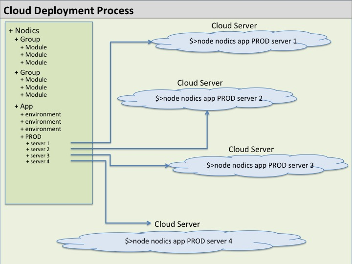

# How To Prepare For Deployment

Deployment means preparing Nodics to run safely in a target environment.

Deployment is not only copying files to a server. It includes configuration, generated artifacts, tests, data, security, and operational checks.



## Beginner Summary

Deployment is the point where a Nodics runtime must be predictable.

Before deploying, a team should know:

- which project is being deployed;
- which environment is targeted;
- which servers and nodes will run;
- which modules are active in each process;
- which tenants are allowed;
- which database, cache, search, messaging, import/export, and storage providers are configured;
- which APIs are exposed;
- which tests prove the release.

The simple rule is:

```text
Do not deploy behavior that cannot be rebuilt, tested, explained, and rolled back.
```

## Before Deployment

Confirm:

- Target environment.
- Node.js and npm versions match the repository runtime contract.
- Dependencies are installed from `package-lock.json` with `npm ci`.
- Active modules.
- Server and node topology.
- Database connection values.
- Cache provider.
- Messaging provider.
- Security secrets.
- Tenant configuration.
- Runtime configuration policy.
- Import and initial data requirements.
- Release tests.

## Build Before Release

Install dependencies from the lockfile:

```bash
npm ci
```

Run:

```bash
npm run build
```

The build command validates governance, documentation, generated artifacts, OpenAPI output, LLM context, and generated documentation coverage.

Dependency release validation must include:

- Node.js 24 as the preferred release line;
- Node.js 22 while it remains in the supported validation matrix;
- Node.js 26 as a forward validation line before adopting it;
- `npm run test:full` before a release candidate;
- dependency updates committed with both `package.json` and
  `package-lock.json`.

## Clean-Checkout Release Gate

Use the governed release gate to prove the repository can be installed,
cleaned, built, regenerated, documented, and tested from a clean checkout.

Print the gate without running it:

```bash
npm run release:check
```

Execute the standard gate:

```bash
npm run release:check -- --execute
```

Execute the release-candidate gate with full validation:

```bash
npm run release:check -- --execute --full
```

The standard gate runs `npm ci`, `npm run clean`, `npm run build`,
`npm run llm:validate`, `npm run quality:docs`, and `npm run test:basic`.
The full gate also runs `npm run test:full`.

## Run Tests

At minimum:

```bash
npm run test:basic
```

For release:

```bash
npm run test:full
```

Run live release tests only against isolated approved infrastructure.

## Verify Topology

Consolidated mode means one server runs many capabilities together.

Modular mode means capabilities run in separate server processes.

Nodics supports both styles because different deployments need different runtime boundaries. Local development may prefer one process. Enterprise deployments may split identity, CMS, workflow, events, scheduled jobs, import/export, and data processing into separate processes.

Before deployment, confirm:

- which server owns each active module;
- which modules run locally in each process;
- which modules are reached through remote server coordinates;
- which nodes are allowed to run scheduled jobs;
- which providers are active for database, cache, search, and messaging;
- where generated reports and diagnostics are written.

Verify modular topology:

```bash
npm run test:topology:modular
```

## Verify Health And Readiness

Use liveness to confirm the process can answer HTTP:

```bash
GET /nodics/system/v0/health/live
```

Use readiness to decide whether the process should receive traffic:

```bash
GET /nodics/system/v0/health/ready
```

Liveness is intentionally low-disclosure and does not require authentication.
Readiness is secured with `system.health.readiness.view` and gated by
`apiExposure.categories.operationalHealth`.

For production, each server/node process should have its own readiness contract.
Provider-specific projects may extend readiness through later modules to check
database, cache, search, messaging, storage, import/export locations, required
secrets, and scheduled-job ownership.

Read the [Production Operating Model](production-operating-model.md) before
using these endpoints as deployment gates.

## Verify Data

Check:

- Initial data is idempotent.
- Sample data is not required in production.
- Tenant data is correctly isolated.
- Imports target the correct tenant.
- Runtime configuration can be audited and rolled back.

Also confirm that versioned or publishable business data has a rollback path when the business process requires it. Published content, catalog data, workflow definitions, runtime configuration, and import runs do not depend on manual database repair as the normal recovery strategy.

## Verify Security

Check:

- Login routes are intentionally pre-authentication.
- Internal module routes remain secured.
- Permissions are assigned to the right groups.
- Service accounts have least privilege.
- Secrets are not stored in source-controlled files.
- Audit logs do not expose credentials.

## Verify Documentation

Documentation should match the deployed behavior.

Run:

```bash
npm run docs:coverage:source -- --limit=20
npm run docs:coverage:contracts -- --limit=20
```

Also regenerate and inspect API documentation when routes or schemas changed:

```bash
npm run docs:openapi
```

For developer/support environments with contract exposure enabled, verify:

```text
GET /nodics/system/v0/contract/openapi
GET /nodics/system/v0/contract/swagger
```

Keep Swagger/OpenAPI secured in shared and production-like topologies.

## What To Avoid

Avoid:

- Deploying unbuilt generated artifacts.
- Changing generated files directly on the server.
- Using local sample data in production.
- Sharing test infrastructure with production.
- Disabling security to make deployment easier.
- Making environment-specific changes in framework source.
- Deploying with unclear active module ownership.
- Mixing sample data with production initialization data.

## Continue

- Previous: [How To Run And Debug Nodics](how-to-run-and-debug-nodics.md)
- Next: [Production Operating Model](production-operating-model.md)
- Security: [How Users, Tenants, And Permissions Work](../security/how-users-tenants-and-permissions-work.md)
- Documentation home: [Nodics Documentation](../README.md)
