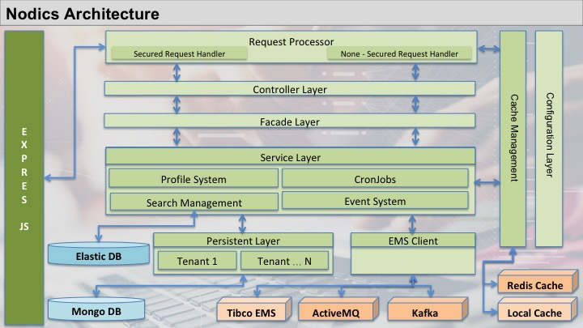
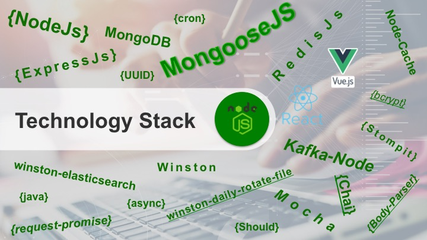
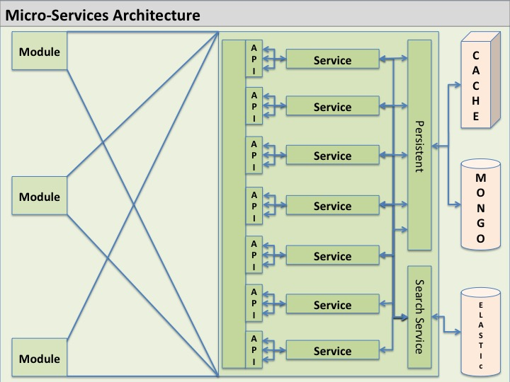

# What Nodics Is

Nodics is an enterprise application factory for building modular, governed, API-driven business platforms.

It is more than a web framework and more than a collection of utilities. Nodics gives an application a complete operating structure: modules, APIs, schemas, services, permissions, tenants, runtime configuration, scheduled jobs, events, imports, exports, search indexing, catalog and content capabilities, tests, generated artifacts, deployment topology, and documentation.



Instead of putting all code in one application folder, Nodics organizes behavior into active capabilities. A capability can provide data models, APIs, services, scheduled jobs, events, import/export behavior, permissions, tests, and documentation. A project can then extend or replace behavior through later-loaded project modules without editing framework files.

Nodics is also built for AI-assisted development. Developers can use CLI-based AI tools, IDE assistants, or conversational coding tools to describe what they want to build. Nodics gives those tools a governed structure to follow so generated or assisted code lands in the right place and respects the same rules as human-written code.

## What Problem Nodics Solves

Many enterprise applications start simple and then become hard to maintain:

- API behavior is spread across many files with no clear owner.
- Configuration is copied into environments and becomes inconsistent.
- Data access rules are duplicated.
- Security decisions are hidden inside controllers.
- Generated files are edited manually.
- Customer-specific changes are made directly inside framework code.
- Testing is added after the behavior already exists.

Nodics solves this by giving every capability a clear place to live, a clear way to be extended, and a clear way to be verified.

That is the main reason Nodics is valuable for AI-assisted MVP development. A team can move quickly with command-line AI tools, IDE assistants, or conversational coding tools, but the generated work still lands inside a governed platform model instead of becoming scattered prototype code that is painful to scale later.

The core rule is:

```text
Capabilities are stable. Implementations can change.
```

For example, Nodics can provide a default database capability. A project can add a new database provider or change data access behavior through the module hierarchy, but it does not edit the original framework source just to serve one customer.

This makes Nodics especially strong for customer-specific enterprise work. The framework provides stable capabilities, while projects negotiate the implementation through approved extension layers.

## Technology Stack

Nodics uses Node.js and JavaScript as the runtime foundation for modular API development. It builds on common enterprise application concerns such as Express-style request handling, schema-driven data behavior, database providers, cache providers, search providers, messaging providers, scheduled execution, import/export processing, generated artifacts, and automated tests.



The stack is intentionally layered. Application developers should depend on Nodics capability contracts such as schemas, services, routers, pipelines, events, cache, search, import/export, and configuration. Provider-specific behavior belongs behind provider modules so a project can change MongoDB, Cassandra, Redis, search, messaging, file, or integration behavior without rewriting business capabilities.

## Why Nodics Is Different

Nodics is designed for teams that need speed without losing architecture. A startup can build an MVP quickly, including APIs, data models, users, jobs, imports, search, and tests, while still keeping the codebase ready for enterprise scale after funding, customer growth, and product expansion.

## Provided Solutions

Nodics provides a ready platform foundation for common enterprise application needs:

- modular API and microservice-style application development;
- tenant-aware identity, profile, authentication, authorization, and permissions;
- schema-driven database behavior and generated CRUD APIs;
- cache layers for API, item, search, auth, and runtime acceleration;
- search indexing and retrieval;
- scheduled jobs and long-running system tasks;
- event and enterprise messaging integration;
- import/export and data hub capabilities;
- catalog, content, and workflow-ready application patterns;
- generated tests, OpenAPI output, documentation context, and AI/developer contracts;
- cloud-ready project, environment, server, and node topology.

Nodics provides:

- **Fast MVP delivery** through ready platform capabilities, generated APIs, module scaffolding, layered configuration, and AI-assisted implementation contracts.
- **Business and service extensibility** through overrideable services, facades, controllers, routers, schemas, processors, interceptors, providers, and data definitions.
- **Distributed system readiness** through environment, server, node, active-module, remote-module, messaging, cache, and scheduled-job boundaries.
- **Testing-oriented development** through generated schema/API tests, module-owned tests, topology tests, import/export tests, security tests, and documentation quality gates.
- **Lower deployment effort** because the same platform model describes local consolidated execution, modular multi-server execution, and cloud-ready process separation.



## Who Uses Nodics

Nodics documentation is written for:

- Application developers building customer projects on top of Nodics.
- Framework developers extending Nodics itself.
- Test engineers validating generated APIs, permissions, imports, jobs, and runtime behavior.
- Technical leads defining project structure, environments, servers, and modules.
- AI coding tools that must follow the same implementation rules as human developers.

## Why Nodics Works Well With AI Tools

AI tools are powerful, but without structure they can create code in the wrong place, duplicate existing behavior, bypass security, or invent a second configuration path.

Nodics reduces that risk by making the application architecture explicit.

An AI tool can be asked to:

- Create a new API.
- Add a scheduled job.
- Add a configuration value.
- Create a new data model.
- Add a database provider.
- Add tests for a feature.
- Update documentation.

Nodics then provides the rules for where that work belongs:

- The owning module.
- The correct source folder.
- The configuration layer.
- The service, controller, route, schema, pipeline, or interceptor contract.
- The generated artifact boundary.
- The tests that must pass.
- The documentation that must be updated.

This lets developers interact with AI tools conversationally while still keeping the platform disciplined.

## Main Ideas

Nodics is based on a few simple ideas.

**Modules own capabilities.** A module owns the behavior, configuration, schemas, tests, and documentation for the feature it provides.

**Projects extend through layers.** A customer project adds or overrides behavior through project modules, environment modules, server modules, node modules, tenant configuration, runtime configuration, or data. It does not modify released framework code unless the work is explicitly framework maintenance.

**Configuration is layered.** Defaults come from the framework. Projects, environments, servers, nodes, tenants, and runtime configuration can refine behavior later in the hierarchy.

**Generated files come from source definitions.** Regenerate generated APIs, schemas, tests, OpenAPI output, and LLM context from the owning source. Do not hand-maintain generated output as the source of truth.

**Security is part of the contract.** Authentication, authorization, access control, validation, audit, rollback, diagnostics, and tests are not optional extras.

## What You Can Build

With Nodics, you can build:

- REST APIs backed by schema definitions.
- Business services and reusable facades.
- Scheduled jobs.
- Import and export flows.
- Search indexing and retrieval flows.
- Catalog, CMS, and content-template driven experiences.
- Tenant-aware applications.
- Event-driven workflows.
- Cache-backed services.
- Runtime configuration tools.
- Generated tests and API contracts.
- Modular customer applications that extend framework behavior safely.

## Framework Functionality At A Glance

Nodics provides the following platform capabilities. This list avoids internal folder-structure detail and focuses on what the framework gives to application teams, framework developers, and AI-assisted implementation tools.

### Platform Foundation

| Functionality | What It Provides |
| --- | --- |
| Enterprise application factory | A governed foundation for building business applications from reusable platform capabilities. |
| Modular application architecture | A way to divide behavior into clear capability boundaries instead of one large application body. |
| Capability ownership | A rule that every behavior, configuration, data model, test, and document has a responsible owner. |
| Layered module hierarchy | A controlled order where later project, environment, server, node, tenant, or customer layers refine earlier behavior. |
| Project extension layers | A project can customize behavior without editing released framework code. |
| Environment extension layers | Environment-specific defaults can differ for local, development, QA, pre-production, and production deployments. |
| Server extension layers | Each runnable process can select its active modules, ports, endpoints, and process-level responsibilities. |
| Node extension layers | Individual nodes can own instance-specific responsibilities such as scheduling, diagnostics, or capacity. |
| Tenant-aware behavior | Runtime behavior can resolve the active tenant and protect tenant-specific data and configuration. |
| Customer-aware behavior | Customer-specific rules can live in customer or project layers instead of framework modules. |
| Runtime governance | Runtime changes can use preview, request, approval, activation, audit, diagnostics, and rollback. |
| Generated artifacts | Models, APIs, tests, OpenAPI output, and LLM context can be regenerated from source definitions. |
| Source-definition driven behavior | Behavior starts from schemas, routes, configuration, services, pipelines, events, and tests. |
| Framework immutability for customer projects | Customer projects extend the framework through approved layers instead of changing out-of-the-box code. |
| AI-assisted development contracts | AI tools receive explicit rules for where to add code, configuration, tests, and documentation. |
| Human developer implementation contracts | Human developers follow the same implementation rules as AI tools. |
| Loader-visible implementation structure | Runtime behavior lives where the Nodics loader can discover, merge, and override it. |
| Module metadata governance | Package metadata identifies ownership, type, order, and dependency expectations. |
| Module lifecycle startup | Modules can participate in startup through the standard Nodics lifecycle. |
| Module lifecycle shutdown | Runtime boundaries can support controlled cleanup and shutdown behavior. |
| Pre-startup scripts | Modules can declare controlled work that runs before normal startup. |
| Post-startup scripts | Modules can declare controlled work that runs after normal startup. |
| Clean process | Generated artifacts and temporary outputs can be removed through governed clean commands. |
| Build process | Source definitions can produce generated runtime artifacts and validation evidence. |
| Generated context | LLM-facing module context is regenerated from source and documentation. |
| Documentation governance | Documentation coverage and quality checks protect developer and AI understanding. |

### Configuration

| Functionality | What It Provides |
| --- | --- |
| Configuration loading | Active modules contribute configuration during startup. |
| Configuration merging | Later layers refine earlier defaults through controlled merge behavior. |
| Layered properties | Values live in owned property namespaces instead of scattered constants. |
| Framework default properties | Framework modules provide default behavior that projects can override safely. |
| Project properties | Customer or application projects can define project-wide behavior. |
| Environment properties | Deployment environments can define environment-level settings. |
| Server properties | Runnable processes can define ports, active modules, and remote endpoints. |
| Node properties | Individual process instances can define node-local overrides. |
| Tenant runtime properties | Tenant-specific configuration can refine behavior after startup. |
| Runtime configuration activation | Approved runtime configuration can become active without editing source files. |
| Runtime configuration preview | Runtime changes can be evaluated before activation. |
| Runtime configuration approval | Sensitive runtime changes can require an approval step. |
| Runtime configuration rollback | Activated runtime changes can return to a previous governed version. |
| Runtime configuration audit | Runtime changes can be recorded with traceable governance evidence. |
| Property namespace ownership | Each configurable value belongs to the module that owns the capability. |
| Startup configuration | Startup uses selected project, environment, server, node, and active modules. |
| Module hierarchy resolution | Nodics resolves load order and effective behavior from module metadata. |
| Active module resolution | Each process knows which modules run locally. |
| Remote module endpoint configuration | Processes can call capabilities hosted by other servers. |
| Server coordinate configuration | Server identity, host, port, and context can come from configuration. |
| Node coordinate configuration | Node identity and instance-level behavior can come from configuration. |
| Configurable route permissions | Route permissions can be resolved from configuration when they vary by layer. |
| Configurable auth security | Auth and internal-token rules can be adjusted through governed configuration. |
| Configurable tooling commands | Development and governance commands can be declared through properties. |
| Configurable documentation governance | Documentation gates can be owned and changed through tooling configuration. |
| Configurable provider selection | Database, cache, search, messaging, and other providers can be selected by configuration. |

### Runtime Topology

| Functionality | What It Provides |
| --- | --- |
| Project topology | The project defines the application, modules, environments, servers, and nodes. |
| Environment topology | Each environment groups the servers that run in that deployment context. |
| Server topology | Each server defines one runnable process composition. |
| Node topology | Nodes provide instance-specific behavior under a server. |
| Modular server execution | Capabilities can run in separate server processes. |
| Consolidated server execution | Multiple capabilities can run together for local or simple deployments. |
| Multi-node execution | Multiple nodes can share a server role while owning different responsibilities. |
| Node responsibility | Jobs, publishers, consumers, or diagnostics can be assigned to selected nodes. |
| Remote module communication | A process can call modules that are active on another server. |
| Internal module communication | Modules can communicate through secured internal service paths. |
| Server-to-server communication | Distributed deployments can coordinate across configured server endpoints. |
| Local active modules | Each server decides which modules execute inside the current process. |
| Remote module endpoints | Configuration describes where remote capabilities are available. |
| Topology validation | Tests and audits verify environment, server, node, and active-module consistency. |
| Topology tests | Automated tests prove consolidated and modular runtime behavior. |
| Runtime report generation | Startup and test runs can produce runtime evidence reports. |
| Runtime diagnostics | Runtime topology can expose enough information to debug process composition. |

### Request And API Layer

| Functionality | What It Provides |
| --- | --- |
| Route registration | Modules expose APIs through owned route definitions. |
| Route metadata | Routes declare method, URL, controller, request type, permissions, and help data. |
| Route permission configuration | Routes can use fixed permissions or configurable permission keys. |
| Route authentication configuration | Routes declare whether authentication is required. |
| Pre-authentication routes | True login or credential-initiation routes can run before a user has a token. |
| Secured routes | Protected APIs validate authentication, tenant context, and permission rules. |
| Internal-token routes | Service-to-service routes remain secured through internal-token permissions. |
| Request normalization | Incoming requests are normalized before business behavior runs. |
| Header normalization | Header values can be standardized for tenant, auth, and traceability behavior. |
| Tenant context resolution | API execution can resolve the active tenant for access and data decisions. |
| Controller execution | Controllers map request and response concerns. |
| Facade orchestration | Facades coordinate service calls and cross-module behavior. |
| Service execution | Services own business logic and replaceable implementation behavior. |
| API response handling | API results can be shaped consistently through the request pipeline. |
| API error handling | Failures can produce consistent, diagnosable responses. |
| API diagnostics | API execution can capture correlation, module, tenant, and failure evidence. |
| Generated CRUD APIs | Schema and route definitions can produce standard create, retrieve, update, and remove APIs. |
| Generated route output | Generated route artifacts come from source definitions and regeneration. |
| OpenAPI generation | Route metadata can generate API documentation. |
| Postman API examples | API examples can support manual exploration and documentation review. |
| API contract tests | Tests prove route behavior, permissions, responses, and generated API contracts. |

### Security And Access Control

| Functionality | What It Provides |
| --- | --- |
| Authentication | Nodics verifies caller identity before protected work runs. |
| Authorization | Nodics checks whether the authenticated caller has the required permission. |
| Permission catalog | Permissions are explicit platform records instead of hidden strings. |
| User groups | Groups organize users, permissions, and access behavior. |
| Parent group inheritance | Groups can inherit permissions through validated parent relationships. |
| Access groups | Schemas and records can declare which groups may access behavior. |
| Schema access policy | Data models can define access expectations at schema level. |
| Route access policy | APIs can define access expectations at route level. |
| Internal service tokens | Module-to-module work can use secured service credentials. |
| API keys | Service principals can use governed API keys. |
| Service principals | Non-human callers can receive scoped identity and permissions. |
| Human login | User login remains separate from internal module access. |
| Employee login | Employee authentication can resolve tenant and credential context. |
| Customer login | Customer authentication can enforce customer-scoped behavior. |
| Pre-authentication boundary | Only true credential-initiation routes run before authentication. |
| Module-to-module security | Internal calls remain secured and permissioned. |
| Tenant isolation | Tenant context protects data, configuration, tokens, and permissions. |
| Customer isolation | Customer-scoped users and records remain constrained to their ownership boundary. |
| Auth cache | Authentication state can be cached for performance. |
| Strict auth cache activation | Unsafe local-only cache behavior can be rejected for production-style deployments. |
| Auth invalidation | User, password, group, or permission changes can invalidate active sessions. |
| Auth version stamping | Tokens can carry version stamps so stale sessions are rejected. |
| Password handling | Password behavior stays inside identity and auth contracts. |
| Credential rotation | Service credentials can be rotated through governed operations. |
| Secret handling | Secrets stay out of source-controlled configuration and logs. |
| Sanitized observability | Security logs avoid exposing credentials, tokens, and sensitive payloads. |
| Security diagnostics | Security failures can produce traceable but safe evidence. |
| Security audit | Sensitive changes can be recorded for review and rollback decisions. |

### Identity And Profile

| Functionality | What It Provides |
| --- | --- |
| Enterprise model | Enterprise records organize business-level ownership. |
| Tenant model | Tenants isolate runtime behavior, users, data, and configuration. |
| Customer model | Customer records support customer-specific identity and ownership. |
| Employee model | Employee records support internal user identity. |
| Principal model | Principals represent authenticated actors. |
| User group model | Groups define inheritance, permissions, and access behavior. |
| Permission model | Permissions define allowed operations. |
| Address model | Address records support profile and customer data. |
| Contact model | Contact records support profile and communication data. |
| Service account model | Service accounts represent non-human callers. |
| API key model | API key records support secured service access. |
| Authentication state | Profile and auth layers manage login, token, and session state. |
| Identity bootstrap | Required identity records can be created during startup. |
| Mandatory identity reconciliation | Startup can create only missing mandatory non-secret groups. |
| Identity governance migration | Identity changes can use preview, apply, rollback, and audit. |
| Identity preview | Identity migration impact can be inspected before mutation. |
| Identity apply | Approved identity changes can be applied idempotently. |
| Identity rollback | Audited identity changes can be rolled back where safe. |
| Identity audit snapshot | Governance records can capture structural identity changes. |
| Ownership policy | Profile records can enforce owner-based access. |
| Customer registration | Registration can force safe customer groups and remove privileged caller input. |
| Profile access control | Profile schemas and routes enforce identity access rules. |
| Tenant model and runtime isolation | Tenant context separates users, tokens, data, permissions, and runtime behavior. |

### Database And Persistence

| Functionality | What It Provides |
| --- | --- |
| Schema definitions | Schemas define stored data, validation, access, and generated behavior. |
| Schema loading | Active modules contribute schema definitions during startup/build. |
| Schema merging | Later layers can extend or override schema behavior through the hierarchy. |
| Schema extension | Projects can add fields or behavior without editing framework schemas. |
| Nested schemas | Embedded structures can model data owned by a parent aggregate. |
| Referenced schemas | Independent records can be linked through references. |
| Model generation | Schemas can produce runtime model artifacts. |
| Generated models | Generated models provide persistence behavior derived from schemas. |
| Generated services | Generated services expose standard behavior for schema-backed data. |
| Generated facades | Generated facades provide orchestration over generated services. |
| Generated controllers | Generated controllers map API requests to generated behavior. |
| Generated routers | Generated routers expose schema behavior over APIs. |
| Generic DAO | Shared DAO behavior supports common persistence operations. |
| Generated CRUD | Standard create, retrieve, update, and remove behavior comes from source definitions. |
| Model middleware | Middleware extends persistence behavior without rewriting generated code. |
| Validators | Validators protect data shape, rules, and lifecycle behavior. |
| Interceptors | Interceptors add lifecycle behavior around persistence changes. |
| Database connection management | Provider modules own database connection lifecycle. |
| Tenant-aware database resolution | Tenant context can influence database selection. |
| MongoDB provider | MongoDB support lives behind provider contracts. |
| Cassandra provider | Cassandra support lives behind provider contracts. |
| Elastic database provider | Elastic database support lives behind provider contracts. |
| Versioned database module | Versioned persistence can support draft, online, and rollback patterns. |
| New database provider extension | New databases are added as provider or project modules. |
| Oracle provider extension path | Oracle support can be added through an owned provider implementation. |
| Persistence diagnostics | Data operations can emit failure and traceability evidence. |
| Persistence tests | Tests prove default, provider, tenant, and override behavior. |

### Validation And Interceptors

| Functionality | What It Provides |
| --- | --- |
| Validation capability | Nodics centralizes validation as a platform capability. |
| Generated validators | Validators can be generated from source definitions. |
| Schema validators | Schema-specific validation protects model data. |
| Request validators | API input validation protects request boundaries. |
| Persistence validators | Persistence validation protects saved data. |
| Save interceptors | Save operations can trigger governed lifecycle checks. |
| Update interceptors | Update operations can validate merged state and policy. |
| Remove interceptors | Remove operations can protect delete behavior. |
| Lifecycle interceptors | Interceptors can run at important model lifecycle points. |
| Access policy interceptors | Access rules can be enforced before persistence changes. |
| Identity interceptors | Identity records can enforce group, principal, and permission rules. |
| Data validation | Import, export, and persistence flows validate records before mutation. |
| Error validation | Failures can be normalized and checked for safe output. |
| Interceptor ordering | Interceptor execution can follow predictable ownership and merge rules. |
| Interceptor extension | Later modules can add or replace interceptor behavior. |
| Validator extension | Later modules can add or replace validation behavior. |

### Services, Facades, And Controllers

| Functionality | What It Provides |
| --- | --- |
| Service layer | Services own business behavior and replaceable implementation logic. |
| Default service scaffolding | New modules can start with standard `init` and `postInit` service hooks. |
| Service override | Later modules can replace specific service functions. |
| Service merge behavior | Service exports can merge through the module hierarchy. |
| Versioned services | Version-aware behavior can support draft, online, and publish flows. |
| Facade layer | Facades coordinate work across services or module boundaries. |
| Facade generation | Source definitions can generate standard facade artifacts. |
| Facade orchestration | Facades handle orchestration without owning low-level persistence. |
| Controller layer | Controllers handle request and response mapping. |
| Controller generation | Source definitions can generate standard controller artifacts. |
| Controller request mapping | Controllers convert HTTP input into Nodics request context. |
| Controller response mapping | Controllers convert service results into API responses. |
| Loader-visible services | Services live where Nodics can discover and override them. |
| Loader-visible facades | Facades live where Nodics can discover and override them. |
| Loader-visible controllers | Controllers live where Nodics can discover and override them. |
| Export-style implementation | Runtime files export mergeable object members for extension. |
| Project service overrides | Projects can change behavior by adding later-loaded services. |
| Customer service overrides | Customer-specific behavior can live in customer/project layers. |

### Pipelines And Processes

| Functionality | What It Provides |
| --- | --- |
| Pipeline definitions | Modules can define ordered execution flows. |
| Pipeline execution | Pipelines execute defined steps in governed order. |
| Pipeline interceptors | Interceptors can hook into process execution. |
| Pipeline services | Services can provide pipeline step behavior. |
| Pipeline extension | Later modules can extend or replace pipeline behavior. |
| Process modeling | Multi-step business behavior can be modeled separately from implementation. |
| Workflow integration | Pipelines can support workflow execution and continuation. |
| Event continuation | Processes can continue from events. |
| Split processing | Work can split across multiple branches where required. |
| Retry processing | Failed process steps can be retried with diagnostics. |
| Lifecycle process state | Long-running behavior can track state. |
| Runtime process diagnostics | Process execution can produce troubleshooting evidence. |

### Events And Messaging

| Functionality | What It Provides |
| --- | --- |
| Event publishing | Modules can publish events after meaningful changes. |
| Event listeners | Modules can react to events through listener definitions. |
| Listener registration | Active modules contribute listeners at startup. |
| Event execution | Event handlers run through framework-managed execution paths. |
| Enterprise messaging | Messaging connects modules and external systems asynchronously. |
| EMS client | The EMS client hides provider-specific messaging details. |
| Message producers | Producers define messages, payloads, and target channels. |
| Message consumers | Consumers define subscriptions, handlers, retries, and failure behavior. |
| Failed-message persistence | Failed messages can be recorded for recovery. |
| Tenant-aware message routing | Message handling can preserve tenant context. |
| ActiveMQ provider | ActiveMQ support lives behind the EMS provider contract. |
| Kafka provider | Kafka support lives behind the EMS provider contract. |
| New messaging provider extension | New brokers are added as provider or project modules. |
| Message retry | Messaging can define retry behavior. |
| Message dead-letter handling | Failed messages can move to controlled failure paths. |
| Message diagnostics | Messaging failures can produce traceable diagnostics. |

### Cache

| Functionality | What It Provides |
| --- | --- |
| Cache capability | Nodics provides cache behavior through a provider-neutral contract. |
| Cache keys | Cache entries use explicit key structures. |
| Cache channels | Cache behavior can be grouped by channel. |
| Cache invalidation | Cached values can be removed when source data changes. |
| Cache flushing | Cache areas can be cleared when needed. |
| Cache TTL | Cache values can expire through configured time-to-live rules. |
| Cache serialization | Cache providers can serialize values consistently. |
| Tenant-scoped cache | Cache keys and channels can preserve tenant separation. |
| Local node cache | Node-local cache can support development or local behavior. |
| Redis cache | Redis support can provide shared distributed cache behavior. |
| Hazelcast cache | Hazelcast support can provide clustered cache behavior. |
| New cache provider extension | New cache engines are added as adapter modules. |
| Cache diagnostics | Cache operations can report failure and provider behavior. |
| Distributed cache behavior | Shared deployments can use cache providers that propagate across nodes. |

### Search

| Functionality | What It Provides |
| --- | --- |
| Search capability | Nodics provides provider-neutral search indexing and retrieval. |
| Search index definitions | Modules define required indexes in source definitions. |
| Indexing pipeline | Data changes can feed indexing behavior. |
| Search queries | Search services normalize query behavior. |
| Search fallback | Search can fall back to database behavior when configured. |
| Search cache policy | Search results can use cache behavior where safe. |
| Search provider selection | Search engines are selected through configuration and provider modules. |
| Elasticsearch provider | Elasticsearch support lives behind the search provider contract. |
| New search provider extension | New engines are added through provider or project modules. |
| Solr provider extension path | Solr support can be implemented behind the search contract. |
| OpenSearch provider extension path | OpenSearch support can be implemented behind the search contract. |
| Search diagnostics | Search operations can emit indexing and query diagnostics. |
| Search tests | Tests prove indexing, retrieval, provider, and fallback behavior. |

### Import And Export

| Functionality | What It Provides |
| --- | --- |
| Data import | Nodics imports structured data into owned schemas and modules. |
| Data export | Nodics exports structured data from owned schemas and modules. |
| Import definitions | Import behavior declares target schema, format, headers, and validation. |
| Export definitions | Export behavior declares source schema, format, fields, and output rules. |
| Header mapping | File headers can map to schema fields. |
| Field mapping | Input and output fields can be transformed through owned definitions. |
| Duplicate handling | Imports can define idempotency and duplicate behavior. |
| Checksum handling | Imports can detect repeated or changed payloads. |
| Import run history | Import executions can be recorded for diagnostics. |
| Export run history | Export executions can be recorded for diagnostics. |
| Import diagnostics | Import failures can report counts, reasons, and affected records. |
| Export diagnostics | Export failures can report counts, reasons, and affected records. |
| Import retry | Failed imports can use controlled retry behavior. |
| Export retry | Failed exports can use controlled retry behavior. |
| Import rollback | Imports can define rollback or recovery behavior. |
| Export rollback | Exports can define recovery behavior when output generation fails. |
| Init data loading | Required startup records can load idempotently. |
| Core data loading | Reference data can be imported intentionally. |
| Sample data import | Demo, local, or test data can be imported separately from production data. |
| JavaScript import | JavaScript import support handles scripted data definitions. |
| JSON import | JSON import support handles JSON data files. |
| CSV import | CSV import support handles comma-separated data files. |
| Excel import | Excel import support handles spreadsheet data files. |
| JavaScript export | JavaScript export support can produce scripted output. |
| JSON export | JSON export support can produce JSON files. |
| CSV export | CSV export support can produce CSV files. |
| Excel export | Excel export support can produce spreadsheet files. |
| New format provider extension | New formats are added through provider or project modules. |

### Scheduled Jobs

| Functionality | What It Provides |
| --- | --- |
| Cron job definitions | Jobs define schedule, handler, owner, context, and permissions. |
| Cron job lifecycle | Jobs can be registered, started, paused, resumed, run, updated, and removed. |
| Cron job registration | Startup can register required scheduled jobs idempotently. |
| Cron job scheduling | Configured triggers decide when jobs run. |
| Cron job start | Jobs can begin scheduled execution. |
| Cron job pause | Jobs can pause without losing the definition. |
| Cron job resume | Paused jobs can return to scheduled execution. |
| Cron job run on demand | Authorized callers can trigger jobs manually when allowed. |
| Cron job logs | Job runs can create execution evidence. |
| Cron job failure state | Failed runs can record status and diagnostics. |
| Cron job node ownership | Nodes can control which process runs which job. |
| Cron job failover ownership | Job ownership can support controlled failover behavior. |
| Cron job handler services | Handlers call services that own real business behavior. |
| Cron job permissions | Lifecycle and run operations require permission checks. |
| Cron job startup idempotency | Starting the server repeatedly does not create duplicate jobs. |
| Cron job tests | Tests prove lifecycle, handler, scheduling, and node responsibility behavior. |

### Workflow

| Functionality | What It Provides |
| --- | --- |
| Workflow capability | Nodics models governed multi-step business processes. |
| Workflow schema | Workflow records define process structure and state. |
| Workflow core engine | Core workflow behavior executes actions and lifecycle transitions. |
| Workflow API | APIs expose workflow operations where allowed. |
| Flow carriers | Carriers hold workflow context as it moves through the process. |
| Flow actions | Actions define units of workflow work. |
| Flow channels | Channels organize workflow communication paths. |
| Flow lifecycle | Workflows can track create, continue, retry, and complete states. |
| Event continuation | Workflows can continue when events arrive. |
| Split workflow behavior | Workflows can branch into multiple paths. |
| Retry workflow behavior | Workflows can retry failed steps. |
| Workflow diagnostics | Workflow execution can emit traceable process evidence. |
| Workflow tests | Tests prove workflow schemas, actions, APIs, and lifecycle behavior. |

### Publishing And Versioning

| Functionality | What It Provides |
| --- | --- |
| Publish capability | Publish behavior supports controlled movement from draft to active state. |
| Versioned services | Services can understand versioned business data. |
| Versioned database behavior | Persistence can support draft, online, and previous states. |
| Versioned MongoDB behavior | MongoDB-backed versioning can support publishable records. |
| Versioned quiz behavior | Quiz data can use version-aware publish behavior. |
| Draft data | Business users can prepare data before publishing. |
| Online data | Published data becomes the active runtime version. |
| Publish lifecycle | Publish flows define prepare, validate, activate, and audit behavior. |
| Version activation | Approved versions can become active. |
| Version rollback | Active versions can return to a previous version. |
| Business data rollback | Business-critical data can keep recoverable versions. |
| Published content rollback | Published content can return to a previous approved state. |
| Catalog versioning | Catalog data can support draft, publish, and rollback expectations. |
| Content versioning | CMS content can support controlled activation and recovery. |

### Content And Catalog

| Functionality | What It Provides |
| --- | --- |
| Catalog capability | Catalogs organize product, content, or domain records. |
| Catalog schemas | Catalog models define structure, hierarchy, and generated behavior. |
| Catalog hierarchy | Catalogs can organize records into nested structures. |
| Sub-catalog resolution | Sub-catalog behavior can resolve child catalog areas. |
| Catalog search integration | Catalog data can participate in search indexing and retrieval. |
| Catalog import | Catalog data can be imported through controlled data flows. |
| Catalog export | Catalog data can be exported through controlled data flows. |
| Catalog publish expectations | Catalog behavior can align with publish/versioning rules. |
| CMS capability | CMS provides reusable content management behavior. |
| CMS schemas | CMS records define sites, pages, components, and related content. |
| CMS routes | CMS APIs expose content behavior where allowed. |
| CMS services | CMS services own content business behavior. |
| CMS content records | Content lives as data, not hardcoded views. |
| CMS component types | Component types define reusable content building blocks. |
| CMS renderer mappings | Renderer mappings connect content types to presentation behavior. |
| CMS page composition | Pages can be composed from content records and components. |
| CMS sample content | Sample content supports demonstrations and local development. |
| CMS tenant visibility | Content visibility can respect tenant or site context. |
| WCMS workflow content | Workflow content extends CMS with process-aware behavior. |
| Content workflow | Content can move through approval or publish processes. |
| Content publishing | Content can be activated through controlled publish behavior. |
| Content templating | Content templates let projects define reusable page and component structures. |

### Commerce

| Functionality | What It Provides |
| --- | --- |
| Commerce group | Commerce modules group reusable shopping and order behavior. |
| Cart capability | Cart behavior manages shopping-cart records and operations. |
| Cart schemas | Cart data models define cart structure. |
| Cart routes | Cart APIs expose cart behavior. |
| Cart services | Cart services own cart business behavior. |
| Cart interceptors | Cart interceptors protect lifecycle and validation behavior. |
| Cart data | Cart modules can own initializer, core, or sample data. |
| Order capability | Order behavior manages order records and operations. |
| Order schemas | Order data models define order structure. |
| Order routes | Order APIs expose order behavior. |
| Order services | Order services own order business behavior. |
| Order interceptors | Order interceptors protect lifecycle and validation behavior. |
| Order initializer data | Order modules can load required startup data idempotently. |
| Commerce tests | Commerce tests prove cart, order, data, and override behavior. |

### Data Exchange And Processing

| Functionality | What It Provides |
| --- | --- |
| DEAP capability group | DEAP groups data exchange, processing, publishing, and consumption behavior. |
| Data processor | Data processors transform or validate incoming data. |
| Data publisher | Data publishers send processed data to target channels. |
| Data consumer | Data consumers receive and handle data from external or internal sources. |
| Data processing pipeline | Processing flows execute ordered transformation steps. |
| Data publishing pipeline | Publishing flows execute outbound data movement. |
| Data consumption pipeline | Consumption flows execute inbound data handling. |
| Data exchange diagnostics | DEAP flows can emit traceable processing and failure evidence. |
| Data exchange tests | Tests prove processor, publisher, consumer, and pipeline behavior. |

### Notification And Communication

| Functionality | What It Provides |
| --- | --- |
| NMS capability | Notification management can organize notification behavior. |
| NEMS capability | Event management and exchange can coordinate module events. |
| Event management | Events can be managed as first-class platform behavior. |
| Event exchange | Modules can exchange events through controlled contracts. |
| Notification routing | Notifications can route through owned communication rules. |
| Communication diagnostics | Communication failures can produce traceable diagnostics. |

### Tokens And OTP

| Functionality | What It Provides |
| --- | --- |
| Token capability | Token behavior supports secure token generation and validation. |
| Token generation | Tokens can be created through owned security contracts. |
| Token validation | Tokens can be checked before protected operations. |
| Token security | Token behavior preserves secret handling and access rules. |
| OTP capability | One-time password behavior supports temporary credential flows. |
| OTP generation | OTP values can be created for controlled verification flows. |
| OTP validation | OTP values can be validated before the protected action continues. |
| OTP expiry | OTP values expire to reduce credential risk. |
| OTP diagnostics | OTP failures can produce safe troubleshooting evidence. |

### Optional And Domain Modules

| Functionality | What It Provides |
| --- | --- |
| KYC capability | KYC modules support customer verification behavior. |
| KYC schema | KYC schemas define verification data. |
| KYC core | KYC core behavior owns verification logic. |
| KYC API | KYC APIs expose verification operations. |
| Customer review system | Review-system modules support customer feedback behavior. |
| Quiz capability | Quiz modules support quiz data and behavior. |
| Quiz workflow | Quiz workflow behavior supports process-aware quizzes. |
| Quiz versioning | Quiz data can support publish/versioning behavior. |
| Quiz API | Quiz APIs expose quiz operations. |

### Testing And Quality

| Functionality | What It Provides |
| --- | --- |
| Test discovery | Nodics discovers tests across active modules and owned test folders. |
| Layered test execution | Tests can prove behavior across framework, project, environment, server, and node layers. |
| Generated schema tests | Schema definitions can produce validation tests. |
| Generated API tests | Route definitions can produce API tests. |
| Generated CRUD tests | Generated CRUD behavior can be tested automatically. |
| Generated scenario tests | Scenario tests can validate end-to-end generated behavior. |
| Runtime override tests | Tests prove later modules can override default behavior. |
| Topology tests | Tests prove project, environment, server, and node topology. |
| Modular topology tests | Tests prove distributed server behavior. |
| Consolidated topology tests | Tests prove single-process behavior. |
| Live test guards | Live tests require explicit activation and avoid unsafe shared data. |
| Test reports | Test execution can produce reports for review. |
| Documentation coverage | Documentation gates verify file and method documentation. |
| Contract coverage | Contract gates verify AI/developer implementation documentation. |
| Structure audit | Structure audits verify module metadata and folder compliance. |
| LLM context validation | Generated AI context can be validated for completeness. |
| Documentation quality governance | Documentation quality checks protect public and implementation docs. |
| Error traceability tests | Tests can prove errors contain useful traceability. |
| Governance reports | Governance commands can report structure, documentation, and runtime evidence. |

### Tooling And AI Enablement

| Functionality | What It Provides |
| --- | --- |
| Nodics tooling CLI | A CLI exposes build, clean, validation, documentation, and governance commands. |
| Command registry | Tooling commands are declared in governed configuration. |
| Tooling command discovery | Tooling discovers commands from active configuration. |
| Tooling command overrides | Projects can override tooling behavior through approved extension paths. |
| Module metadata audit | Metadata audits verify ownership, kind, and dependency correctness. |
| Module generation | Generators can create compliant module scaffolds. |
| Project generation | Generators can create compliant project structure. |
| Environment generation | Generators can create compliant environment modules. |
| Server generation | Generators can create compliant server modules. |
| Node generation | Generators can create compliant node modules. |
| Provider generation | Generators can create provider-module scaffolds for integrations. |
| LLM context generation | Source and docs can produce AI-readable module context. |
| LLM context validation | Generated AI context can be checked before use. |
| AI contracts | Contracts tell AI tools how to implement safely. |
| AI examples | Examples show correct extension and customization patterns. |
| AI prompts | Prompts guide repeatable AI-assisted workflows. |
| Module catalog | Catalogs summarize module responsibilities. |
| Module standards | Standards define compliant module and project structure. |
| Structure matrix | Matrix guidance explains project, group, module, environment, server, and node ownership. |
| Developer implementation contract | Implementation rules apply to both human and AI developers. |
| Human maintainability contract | Maintainability rules keep code readable, reviewable, and traceable. |
| MCP bridge planning | MCP integration is planned as a bridge over Nodics-owned contracts. |
| Guarded mutation planning | Mutation tooling is planned around explicit approval and governance. |

### Setup And Documentation

| Functionality | What It Provides |
| --- | --- |
| Setup guidance | Setup docs explain how to install, build, and run Nodics. |
| Onboarding guidance | Onboarding docs guide new users through the framework. |
| Public documentation | `gDocs` provides user and developer-facing guidance. |
| Module documentation | Module README files explain capability ownership and extension paths. |
| Product documentation | Product docs explain current Nodics behavior directly. |
| GitHub documentation publishing | Documentation can be published from repository-controlled sources. |
| GitHub Pages documentation | GitHub Pages can host readable public documentation. |
| GitHub Wiki indexing | GitHub Wiki can index or mirror official documentation links. |
| README documentation | The root README introduces Nodics and routes users to deeper docs. |
| AGENTS behavior contracts | AGENTS files guide AI and developer behavior in code areas. |
| Generated documentation | Generated docs come from source definitions and regeneration. |
| Documentation source map | Docs have clear ownership by audience and purpose. |
| Documentation writing style | Docs use task-based, direct, user-readable language. |
| Documentation verification | Documentation checks validate links, coverage, and governance. |

### Sample Project And Deployment

| Functionality | What It Provides |
| --- | --- |
| Startio project | Startio validates Nodics end-to-end as a compliant sample project. |
| Project module group | Project modules group application-owned capabilities. |
| Project API module | API modules expose project-specific routes and behavior. |
| Project core module | Core modules own project business behavior. |
| Project integration module | Integration modules own external or cross-system behavior. |
| Local environment | Local environment supports developer execution. |
| Development environment | Development environment supports shared development validation. |
| QA environment | QA environment supports quality assurance validation. |
| Pre-production environment | Pre-production environment supports release readiness validation. |
| Production environment | Production environment supports live deployment configuration. |
| Consolidated local server | Local execution can run many capabilities in one process. |
| Profile server | Profile capabilities can run as a dedicated server. |
| Cron server | Scheduled jobs can run as a dedicated server. |
| NEMS server | Event management can run as a dedicated server. |
| CMS server | Content capabilities can run as a dedicated server. |
| Workflow server | Workflow capabilities can run as a dedicated server. |
| DEAP server | Data exchange and processing can run as a dedicated server. |
| Server nodes | Nodes can divide responsibilities under a server. |
| Multi-node startup | Multiple nodes can start and coordinate responsibilities. |
| Debug startup | Startup can support debugging modes for developers. |
| VS Code inspect startup | Nodics can run with inspector support for breakpoint debugging. |
| Deployment preparation | Deployment docs guide validation before release. |
| Dependency governance | Dependencies can be reviewed, upgraded, and tested as part of platform maintenance. |
| Dependabot review | GitHub vulnerability reports can guide dependency upgrade work. |

## What Makes Nodics Different

Nodics is designed around enterprise extension, not one-off application code.

It combines:

- Modular capability ownership.
- Layered project customization.
- Tenant-aware runtime behavior.
- Source-defined generated artifacts.
- Security and permission contracts.
- Runtime configuration governance.
- Test and documentation gates.
- AI-readable implementation guidance.

That combination allows teams to move fast without giving up control.

## What To Read Next

If you are new, continue with [How To Set Up Nodics](../getting-started/how-to-setup-nodics.md).

If you already have Nodics running, read [How Nodics Is Organized](../architecture/how-nodics-is-organized.md).
