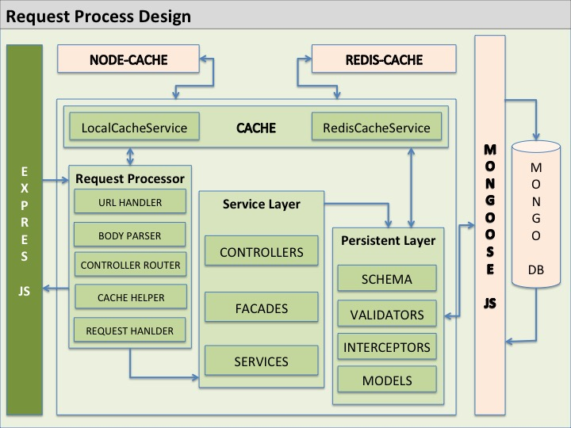
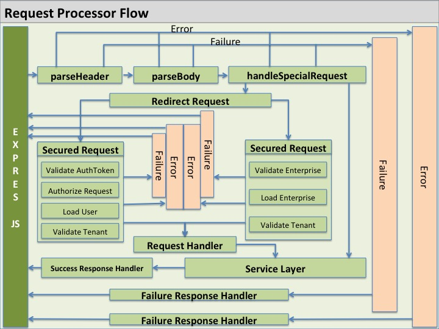
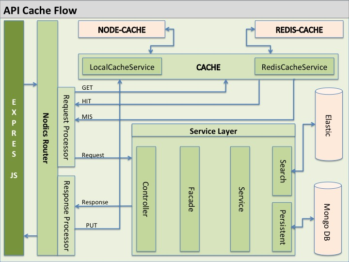
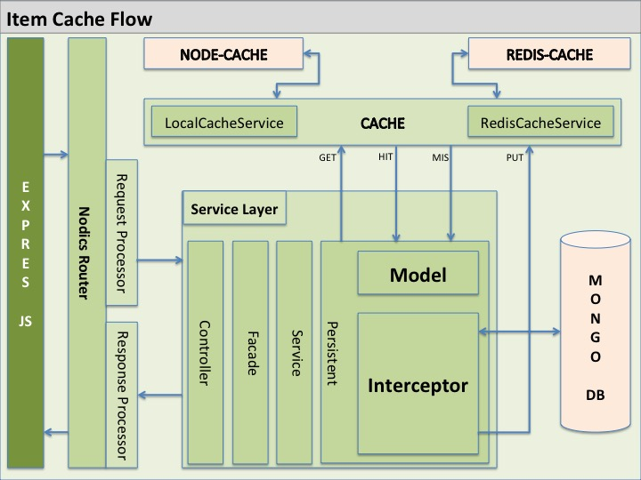
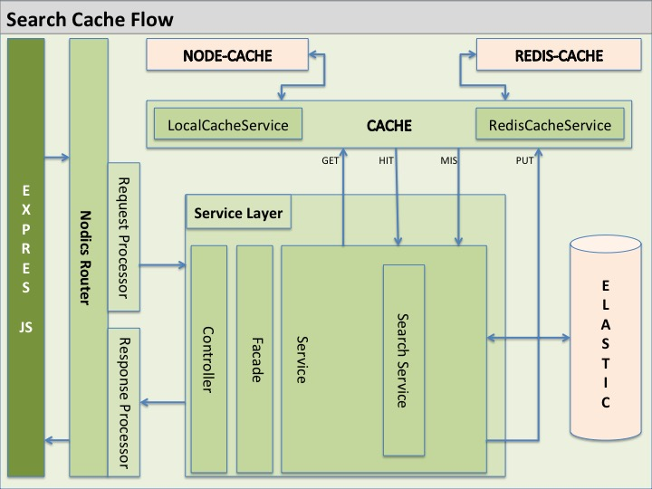
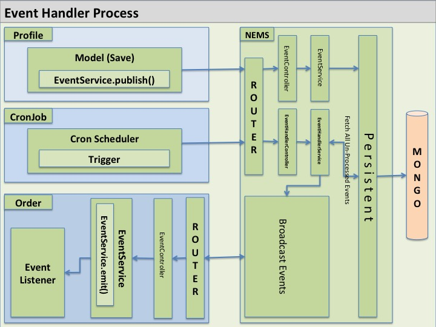
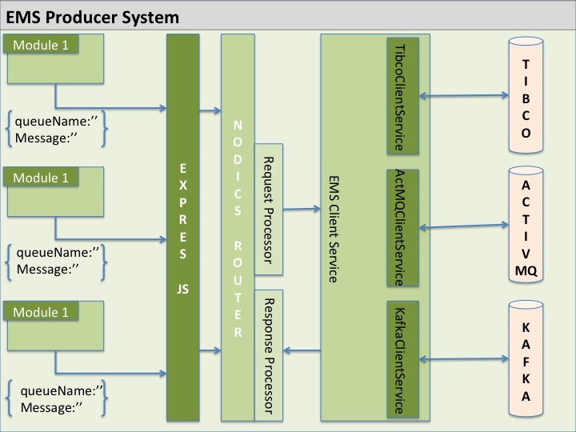
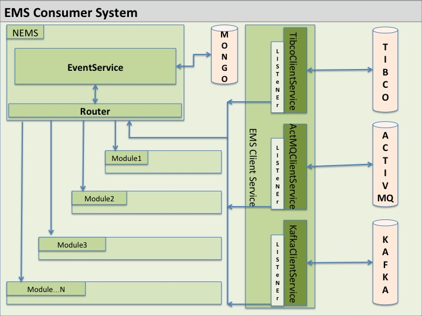
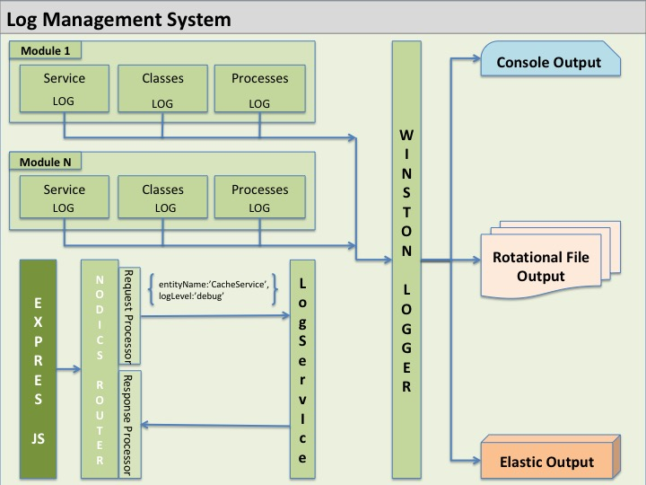

# How Platform Capabilities Work

Nodics is built as a platform, not as a single API application. Platform capabilities provide reusable behavior that many business modules can use: request handling, processes, cache, messaging, logging, import/export, testing, runtime governance, and deployment topology.

Nodics implements platform capabilities through active modules, source definitions, layered configuration, runtime governance, generated artifacts, and tests.

## Beginner Summary

A platform capability is reusable framework behavior that many business modules
can depend on. Examples include routing, cache, import/export, messaging,
scheduled jobs, workflow, search, configuration, testing, and runtime
governance.

Business modules should use these capabilities instead of building private
copies. For example, a feature that needs cache should use the cache capability.
A feature that needs a process should use a pipeline or workflow capability. A
feature that needs an API should use router/controller/facade/service layers.

The simple rule is:

```text
Use the platform capability before inventing a private implementation.
```

## Platform Capability Rule

A platform capability is reusable, configurable, tenant-aware where required, and replaceable through a later module.

Before adding or changing a platform feature, ask:

- Which module owns the capability?
- Which source definition controls the behavior?
- Which configuration values can change by project, environment, server, node, tenant, or runtime governance?
- Which services, pipelines, events, or routers execute the behavior?
- Which tests prove default behavior and override behavior?
- Which documentation and generated LLM context must be updated?

Do not add platform behavior as one-off helper code. Platform behavior has an owner, a contract, a configuration path, and a test boundary.

## Capability Placement Map

| Need | Capability/docs to use |
| --- | --- |
| Expose an API | Router, controller, facade, service docs |
| Validate and process ordered steps | Pipeline framework docs |
| Run stateful business lifecycle | Workflow/nbpm docs |
| React to something that happened | Event/NEMS docs |
| Run timed work | CronJob docs |
| Speed repeatable reads | Cache docs |
| Import/export records | Data/import/export docs |
| Make data searchable | Search docs |
| Change behavior safely at runtime | Runtime configuration/dynamo docs |
| Run across multiple servers/nodes | Topology and service communication docs |
| Prove behavior | Testing docs |

When an AI tool proposes a custom helper, compare the helper to this table. If a
platform capability already exists, use the capability contract.

## Request Handling

Request handling is the path from an incoming API call to secured business behavior.



A request normally passes through:

1. Route registration.
2. Request metadata and header normalization.
3. Tenant and context resolution.
4. Authentication and authorization.
5. Controller execution.
6. Facade or service orchestration.
7. Data access, search, cache, event, or workflow behavior.
8. Response and diagnostics handling.

The route definition makes the API contract visible. Permission behavior, pre-authentication behavior, cache policy, help metadata, and OpenAPI generation come from route/source metadata, not from hidden controller assumptions.

Related module documentation:

- [nRouter](../../gFramework/nRouter/README.md) and [Router Framework](../../gFramework/nRouter/docs/router-framework.md) for API route registration, request pipeline behavior, security, and controller dispatch.
- [nController](../../gFramework/nController/README.md) for controller request mapping.
- [nService](../../gFramework/nService/README.md) for service contracts after controller handoff.



## SecuredRequestProcessService

The secured request process handles APIs that require identity, tenant context, and permission checks before controller execution.

Secured request handling normally includes:

- parsing and normalizing headers;
- resolving tenant and request context;
- validating auth token, API key, or internal service token;
- authorizing the caller against route permission metadata;
- applying route, cache, and security policy;
- dispatching to the controller;
- returning a consistent success or error response.

Do not mark a route unsecured just to avoid token or permission errors. Fix the route permission, caller identity, token, tenant, or service account configuration.

## NonSecuredRequestProcessService

The non-secured request process is for routes that intentionally run before authentication, such as true login or credential-initiation routes.

Non-secured does not mean ungoverned. It still needs route ownership, validation, tenant or enterprise context when required, diagnostics, abuse protection where applicable, and clear tests.

## Handle Secured Request Process

A secured request must validate the caller before business behavior runs.

Important secured steps include:

- `Validate AuthToken`: confirm the token or credential is present, valid, current, and not invalidated;
- `Authorize AuthToken`: confirm the authenticated principal has the permission required by the route;
- tenant resolution: ensure the token/request tenant is allowed for the route and data operation;
- controller dispatch: call the registered controller only after security succeeds.

## Handle Non-Secured Request Process

Non-secured request handling is reserved for explicitly declared pre-authentication routes.

### Validate EnterpriseCode

When a route needs enterprise context before login, validate the enterprise code from the approved request/header location. Do not trust arbitrary enterprise codes to broaden tenant or customer scope.

### Load EnterpriseCode

After validation, load enterprise context through the owning profile/tenant capability. The loaded enterprise context may guide login or signup behavior, but it must not bypass later authentication or authorization for protected APIs.

## Generalizing Process

Generalize request processes through route metadata, pipeline definitions, services, interceptors, and configuration. A project can add validation or change a handler in a later module, but it must preserve security, tenant context, diagnostics, and response shape.

## Generalizing Services

Request process services are normal Nodics services. Override them through the active module hierarchy only when the request-process contract remains clear and tested. Do not create parallel Express middleware that bypasses Nodics route metadata or security policy.

## Processes And Workflows

Model process-style behavior through the owning module's pipeline, workflow, event, job, or service contract.

Use process or workflow behavior when:

- work has multiple steps;
- steps may pause, resume, retry, split, or continue through events;
- a business operation needs lifecycle state;
- multiple services or modules must participate in a governed order.

Keep the process definition separate from the implementation. The definition explains the intended process. Services, handlers, interceptors, pipelines, and workflow actions perform the work.

Related module documentation:

- [nPipeline](../../gFramework/nPipeline/README.md) and [Pipeline Framework](../../gFramework/nPipeline/docs/pipeline-framework.md) for ordered process execution and customization.
- [nbpm](../../gFramework/nbpm/README.md) for stateful workflow lifecycle behavior.
- [nEvent](../../gFramework/nEvent/README.md) for event-driven extension behavior.

## Generalizing Default Process

Default processes are framework-provided execution paths such as request handling, model save/update/remove/get, import finalization, search indexing, scheduled-job lifecycle, event distribution, or message processing.

Generalize a default process only through its defined extension points:

- pipeline definitions;
- pipeline nodes;
- processors;
- interceptors;
- services;
- events;
- configuration;
- tests.

Do not duplicate a default process because one node needs different behavior. Override or extend the node/service through the owning module layer.

## Generalizing Predefined Process

Predefined processes can be changed by later modules when the capability contract allows it.

Before changing a predefined process, document:

- process name;
- owning module;
- node being changed;
- reason for the change;
- inputs and outputs;
- error behavior;
- tenant and security impact;
- tests for default and effective behavior.

### Change A Node In An Existing Process

Changing a node means replacing the handler or behavior of one step in an existing process.

Use this when the process sequence is still correct, but one step needs project-specific logic. The replacement node must accept the same request/response/process context and must call success or error consistently.

### Add A Node In An Existing Process

Adding a node means introducing a new step before, after, or between existing steps.

Use this when a project needs additional validation, enrichment, diagnostics, event publication, approval, or provider interaction. Do not add a node that bypasses a later security, validation, persistence, or diagnostics step.

## Cache Management

Cache exists to improve performance without becoming a second source of truth.



Use cache for repeatable reads, computed values, remote lookup results, auth/session acceleration, or expensive data that can be safely refreshed.

When adding cache behavior, document:

- what is cached;
- who owns the cached value;
- cache key structure;
- tenant/customer isolation;
- expiry and invalidation behavior;
- provider selection;
- failure behavior when the cache is unavailable;
- diagnostics and tests.

Provider-specific behavior belongs in provider modules such as Node cache, Redis, or Hazelcast support. Generic modules should depend on the cache capability contract, not on one provider's implementation.

Nodics cache behavior can appear at different layers:

- API cache stores safe route responses when route metadata and tenant/security context allow it.
- Item cache stores reusable object or lookup results behind the owning service contract.
- Search cache stores repeatable search results when the search contract allows it.





Related module documentation:

- [nCache](../../gFramework/nCache/README.md), [cache](../../gFramework/nCache/cache/README.md), [redisCache](../../gFramework/nCache/redisCache/README.md), [nodeCache](../../gFramework/nCache/nodeCache/README.md), and [hazelcastCache](../../gFramework/nCache/hazelcastCache/README.md).
- For detailed cache configuration, invalidation, diagnostics, and troubleshooting, read [How Cache Works](how-cache-works.md).

## Invoking Engine

Cache engine invocation should go through the Nodics cache capability, not directly through provider clients.

The effective cache configuration selects the engine, channel, TTL behavior, key strategy, serialization, tenant partitioning, and invalidation behavior. Business code asks the cache capability to get, put, consume, flush, or invalidate data. The selected engine implements the provider-specific behavior.

This keeps API cache, item cache, search cache, and auth/runtime caches replaceable across local, Redis, and future provider engines.

Cache also has secured operational controls for flushes and scoped API/item cache configuration changes. These controls are useful when operations needs to adjust cache behavior in a running system, but they are immediate cache events, not a substitute for the governed runtime configuration lifecycle. Use `nDynamo` when a cache-related decision must be previewed, approved, audited, rolled back, or retained as a tenant/business runtime contract.

## Invalidating Cache

Cache invalidation is part of the data/security contract.

Invalidate cache when:

- a model changes and cached reads may be stale;
- permissions, user groups, or access policy changes;
- auth/session state changes;
- runtime configuration changes;
- search index data changes;
- a provider reports stale or unsafe state.

Invalidation must preserve tenant, principal, route, schema, and provider boundaries. A broad flush may be acceptable for operations or development, but production invalidation should be targeted where practical and must be observable.

## Messaging And Events

Messaging lets modules communicate without forcing every operation into a direct API call.



Use events or messages when:

- another module should react after a business change;
- work can be asynchronous;
- the producer does not own the consumer's implementation;
- a provider such as Kafka or ActiveMQ may be used behind the same capability.

Messaging contracts define event names, payload shape, tenant context, retry behavior, error handling, and diagnostics. Provider configuration, broker endpoints, credentials, queue names, and topic names must be layered configuration or governed secrets, never hardcoded in source.

Related module documentation:

- [nEms](../../gFramework/nEms/README.md), [emsClient](../../gFramework/nEms/emsClient/README.md), [kafka](../../gFramework/nEms/kafka/README.md), and [activemq](../../gFramework/nEms/activemq/README.md).





## EventLog

EventLog records event execution evidence where the event capability requires persistence or diagnostics. An event log entry should help answer what event was raised, which tenant/context owned it, which handler processed it, whether it succeeded, and why it failed.

Event logs must be sanitized. They must not expose secrets, full tokens, credentials, or sensitive payloads.

## Listening An Event

Listening to an event means registering module-owned behavior that reacts when an event is published.

To listen to an event:

1. Decide which module owns the reaction.
2. Create a loader-visible service function that performs the reaction.
3. Register the listener in the module event/listener definition.
4. Preserve tenant and request context.
5. Handle duplicate, missing, or invalid payloads.
6. Add tests for successful handling and failure behavior.

Do not make an event listener update unrelated data without a clear owner, idempotency rule, diagnostics, and tests.

## Logging And Diagnostics

Logs and diagnostics are part of platform governance.



Good diagnostics identify:

- module;
- operation;
- tenant or customer context where safe;
- correlation id;
- result;
- reason code for failure;
- sanitized error detail.

Logs must not expose credentials, tokens, secrets, or sensitive payloads. The
central logger redacts configured sensitive fields before supported transports
serialize log output, but developers should still log safe metadata instead of
raw secrets.

Use logs to capture:

- capability owner;
- operation name;
- tenant or customer context when safe;
- correlation id or run id;
- reason code;
- status;
- safe counts and timing.

Do not log generated tokens, caller-submitted tokens, passwords, API keys,
cookies, authorization headers, private keys, connection-string credentials, or
full sensitive payloads. Configure extra redaction keys under
`log.redaction.sensitiveKeys` in layered `properties.js` when a project adds a
new credential field.

When a failure affects runtime governance, imports, jobs, messaging, or
security, diagnostics support audit and rollback decisions without exposing
usable credential material.

## Data Import And Export

Import/export is a platform capability because many modules need controlled data movement.

The import/export contract defines file format, headers, target schema, tenant, validation, duplicate handling, diagnostics, run history, retry behavior, and rollback impact.

Format-specific support such as JavaScript, JSON, CSV, and Excel belongs in provider modules. New formats should follow the same provider pattern instead of changing the generic import/export engine directly.

## Runtime Governance

Runtime governance allows controlled changes after deployment.

Use runtime governance for changes that need preview, request, approval, activation, audit, diagnostics, and rollback. Runtime governance must not become a hidden source of architecture. Source definitions, module metadata, layered configuration, and tests remain the authority for platform contracts.

## Testing Platform Capabilities

Platform capabilities need more than happy-path tests.

Test:

- default behavior;
- later-module override behavior;
- tenant isolation;
- permission and access failure;
- provider selection;
- diagnostics and sanitized failure output;
- consolidated runtime behavior;
- modular server-to-server behavior where applicable.

Use generated tests when schema or route definitions change, and add focused tests for provider, process, cache, messaging, and runtime-governance behavior.

## What To Avoid

Avoid:

- using cache as the only source of truth;
- hardcoding provider endpoints or credentials;
- bypassing tenant context in events, logs, imports, or cache keys;
- hiding permissions inside controllers;
- creating background processes with no owner or diagnostics;
- adding platform helpers outside loader-visible module paths;
- changing framework code when a provider or project module can own the customization.

## Continue

- Cache detail: [How Cache Works](how-cache-works.md)
- Owning modules: [Module Documentation Index](../reference/module-documentation-index.md)
- Maturity: [Provider And Capability Maturity Matrix](../reference/provider-capability-maturity-matrix.md)
- Documentation home: [Nodics Documentation](../README.md)
