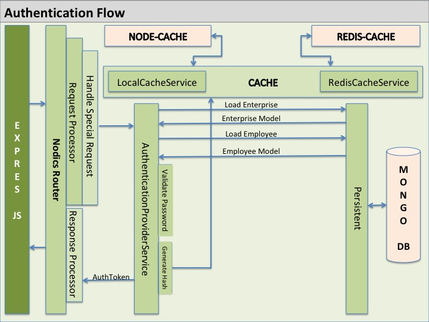
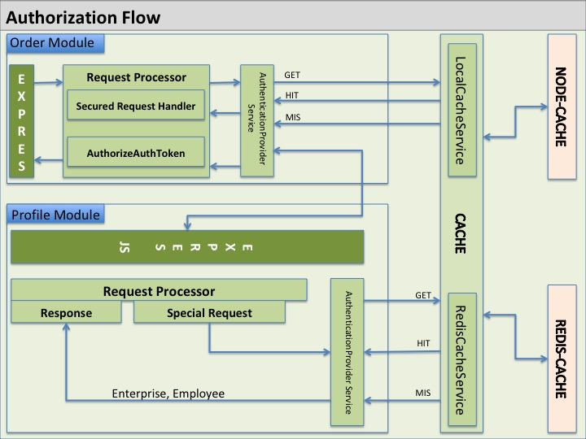

# How Users, Tenants, And Permissions Work

Nodics applications are tenant-aware.

A tenant represents an isolated business context. Different tenants can have different users, permissions, data, configuration, and runtime behavior.

## Why Tenants Matter

Tenant isolation helps one platform serve multiple business contexts safely.

Examples:

- One customer can use the same application without seeing another customer's data.
- A business can test configuration for one tenant before enabling it for another.
- Runtime configuration can be audited per tenant.
- Data imports can target a specific tenant.

## Users And Groups

Users are assigned to groups.

Groups can hold permissions.

Permissions decide what a user or service account can do.

When adding a feature, define the required permissions clearly. Do not rely on hidden checks that only one developer understands.

## NAAM System

NAAM means Nodics Authentication And Authorization Management. It is the identity and access-control capability that protects users, service accounts, tenants, permissions, tokens, and secured routes.

NAAM separates:

- human login;
- employee/customer identity;
- service-to-service access;
- API key and service principal access;
- authorization through permissions and user groups;
- tenant isolation;
- auth cache and invalidation;
- safe diagnostics.

Do not treat login, internal tokens, API keys, permissions, and tenants as one interchangeable mechanism. Each has a separate security purpose.

## Human Login

Human login routes are pre-authentication because the user does not have a token yet.



Only true login or credential initiation routes are pre-authentication.

After login, secured APIs must validate authentication, tenant context, and permissions.



## Service-To-Service Access

Internal module or service access is different from human login.

Internal access remains secured and uses the configured internal token or service-account permission model.

Do not make internal routes public just to make module-to-module calls easier.

## Runtime Security

Runtime changes must be governed.

Important runtime actions should include:

- Preview.
- Request.
- Approval.
- Activation.
- Audit.
- Rollback.
- Diagnostics.

This applies especially to configuration, route permissions, schema behavior, and tenant-sensitive settings.

## Add New Tenant

Adding a tenant means introducing a new isolated business/runtime context. A tenant may need users, groups, permissions, data, runtime configuration, import scope, cache partitioning, job behavior, and service-account access.

When adding a tenant, document:

- tenant code and business owner;
- enterprise or customer relationship;
- required groups and permissions;
- startup or initial data;
- data provider or schema expectations;
- runtime configuration;
- import/export scope;
- cache and auth invalidation behavior;
- tests for isolation.

### Add in InstalledTanents

The recovered wiki used the spelling `InstalledTanents`. In current Nodics documentation, treat this as the installed or active tenant list that the selected runtime is allowed to use.

Do not activate a tenant only by passing a request header. The tenant must be known to the active runtime, backed by configuration/data, and verified by tests. Request tenant context may narrow execution, but it must not secretly create or broaden tenant scope.

## Testing Security

Security tests should cover:

- Login route behavior.
- Token validation.
- Permission checks.
- Tenant isolation.
- Service account access.
- Invalidation after security changes.
- Audit records without secrets.

## Bootstrap Credentials

Framework initializer data must not ship usable default passwords, API keys, or
service credentials. Mandatory bootstrap may create missing non-secret groups,
permissions, and principal metadata, but credential material must come from
governed project/environment/server/node configuration, secret management, or an
explicit credential-rotation operation.

Active bootstrap principals must use a declared secret source. Configure
`bootstrapIdentity.source`, `adminPassword`, `servicePassword`, and
`serviceApiKey` in the active project/environment/server/node layer or through a
governed external/secret source. Production-like sources include `environment`,
`externalProperty`, `secretManager`, and `runtimeSecret`. Local sample and test
sources are accepted only when
`authSecurity.compatibility.allowLocalBootstrapIdentity` is explicitly enabled
by the local/test layer.

When framework modules seed example users for capability ownership, keep those
users inactive unless a project layer deliberately activates them, and generate
non-reusable placeholder password material instead of source-controlled
passwords. Service API keys must not be embedded in framework data files.

## Control-Plane API Permissions

Control-plane APIs are backend APIs used by administrators, support tooling,
CLI tools, AI tools, or a future admin application to inspect or change runtime
state. They are not UI screens.

Control-plane APIs use two separate gates:

1. `apiExposure` decides whether an API category is available in the current
   project, environment, server, or node.
2. Route permission metadata decides whether the authenticated caller may use
   the exposed route.

This separation matters in a micro-services topology. A local developer server
can enable test execution, dynamic class inspection, file access, import/export,
or diagnostics when those capabilities are needed for development. A
production-like server should expose only the categories required for operations
and should keep local-only utilities disabled even if a user has broad
permissions.

Every control-plane route must declare an action-specific permission in route
metadata or an explicit `permissionConfig`. Broad access groups such as
`userGroup` may remain as a base authenticated-user boundary, but they are not
enough for sensitive operations.

Examples of action-specific control-plane permissions include:

- `runtime.config.preview`
- `runtime.config.request.activate`
- `system.file.read`
- `system.log.level.update`
- `system.schema.index.rebuild`
- `system.schema.validator.rebuild`
- `import.local.run`
- `export.run`
- `dynamo.class.update`

When adding a new control-plane API, update the permission catalog, seed or
govern the correct user group, add a route contract test, and verify the
cross-module control-plane route permission contract.

When the API is sensitive to topology, also declare an `apiExposure` category in
the route metadata and prove that disabled categories fail closed before route
help or controller execution. Enable categories through layered
`config/properties.js` only in the project, environment, server, or node where
the category is intentionally available.

## HTTP Hardening By Topology

HTTP hardening protects how each Nodics server or node accepts traffic before a
request reaches business behavior. It is separate from `apiExposure` and route
permissions:

- `httpHardening` controls CORS, response security headers, body limits, rate
  limits, and proxy trust for the running topology.
- `apiExposure` controls whether a sensitive API category exists in that
  runtime.
- permissions control whether the authenticated caller may use an exposed API.

Framework defaults keep browser cross-origin access closed, security headers
enabled, body parsing bounded, proxy trust disabled, and a conservative
per-process rate limit enabled. Local project layers such as `startioLocal` may
enable local browser origins for development. Production-like deployments should
define only the origins, proxy behavior, body limits, and traffic limits required
for that server or node.

Do not put CORS, rate-limit, proxy, body-size, or security-header policy inside
controllers or feature services. Define the policy in layered
`config/properties.js` or override the router hardening service in a later
module when a deployment needs API gateway, service mesh, or provider-specific
enforcement.

Useful commands:

```bash
npm run test:suite -- --suite=headers
npm run test:suite -- --suite=auth-p2
npm run test:basic
```

## What To Avoid

Avoid:

- Marking routes unsecured without a documented reason.
- Mixing human login rules with service-to-service rules.
- Skipping tenant context checks.
- Logging secrets.
- Creating permissions without documentation.
- Adding runtime mutation paths without audit and rollback.
